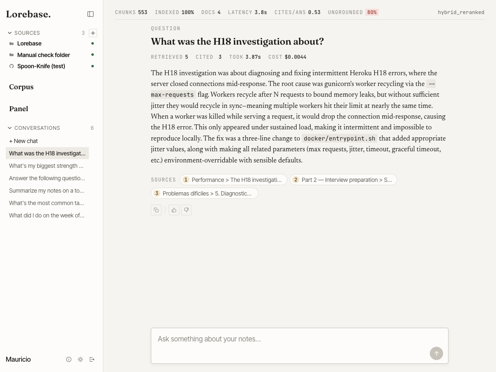
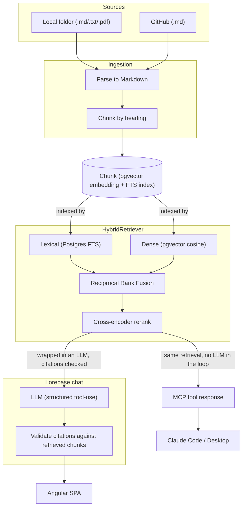
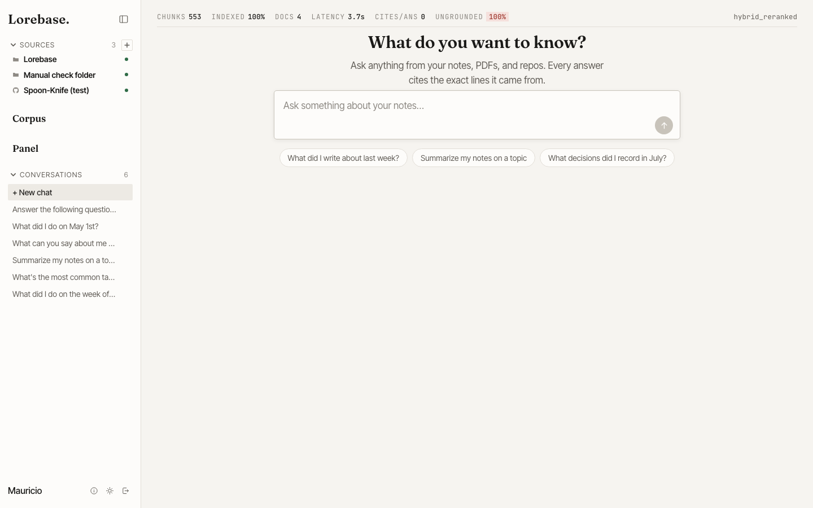
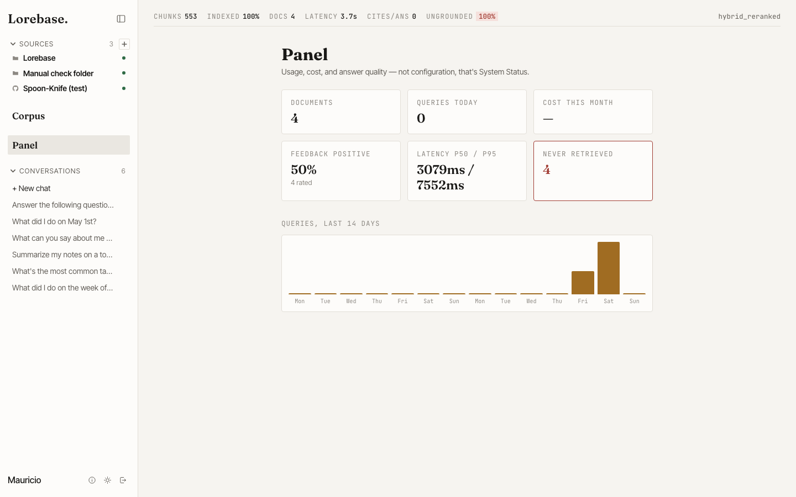

# Lorebase

[](https://github.com/murraco/lorebase/actions/workflows/ci.yml)

Self-hosted RAG for your own notes, PDFs, and GitHub repos — with citations
you can verify. Ask a question in plain English (or Spanish) and get an
answer that points back to the exact file and line it came from.

<p align="center">
  
</p>

Every citation is verified server-side before it's ever shown: the model
returns structured tool-use output naming which `chunk_id`s it relied on,
and any id that wasn't actually in the retrieved context is discarded before
the answer is persisted. A citation is a guarantee, not a prompt request.

## Why it exists

Lorebase is a learning project built to go deep on retrieval-augmented
generation — hybrid search, reranking, agentic vs. direct retrieval,
evaluation methodology, and exposing an LLM app as an MCP server — on top of
a stack (Django, PostgreSQL, Celery, Angular) that was already familiar
going in. The interesting parts are retrieval quality and correctness, not
plumbing, so the plumbing is intentionally boring and the retrieval code is
where the real decisions live.

## What it does

- **Three source types**: a local folder of Markdown/plain-text notes,
  PDFs (parsed to Markdown and chunked through the exact same path as
  notes — one chunker, not two), and GitHub repositories.
- **Hybrid search**: PostgreSQL full-text search (lexical) and pgvector
  cosine similarity (dense) fused with Reciprocal Rank Fusion, then
  re-ranked by a cross-encoder before the top-k reaches the LLM.
- **Verifiable citations**: structured tool-use output, validated against
  the real retrieved context before anything is saved — see
  [ADR 0004](docs/adr/0004-verified-citations-via-tool-use.md) for why this
  matters more than prompting for citations.
- **Streaming chat** over SSE from an async Django view, with per-message
  latency/token/cost tracking and a feedback (👎/👍 + comment) loop.
- **A dashboard** (chunk/doc counts, query volume, cost, latency p50/p95,
  and a "notes never retrieved" signal for orphaned knowledge).
- **An MCP server** (Streamable HTTP, bearer-token auth scoped to a
  workspace membership) exposing the same retrieval to Claude Code / Claude
  Desktop — see [`docs/mcp-server.md`](docs/mcp-server.md).
- **A real evaluation harness**: RAGAS metrics plus a deterministic
  hit-rate check against a 30-question golden set, used to make an actual
  measured call between direct and agentic retrieval (below) instead of
  guessing.

## Architecture



The same `HybridRetriever` feeds two different consumers: Lorebase's own
chat wraps it in an LLM call with server-side citation validation, while
the MCP server hands the raw retrieval results straight to an external
agent — no LLM or validation layer of Lorebase's own in that path, since
the calling agent is the one deciding what to do with the results.
Sources, embedding providers, rerankers, and the LLM provider are all
swappable behind small interfaces (`Connector`, `EmbeddingProvider`,
`Retriever`, `LLMProvider`) — new implementations, not redesigns, are what
it costs to add a fourth source type or switch vector databases.

## Key design decisions

Choices that weren't forced or obvious enough to skip past, written up as
ADRs:

- **[pgvector instead of a dedicated vector database](docs/adr/0001-pgvector-over-qdrant.md)**
  — one database, transactionally consistent with everything else, at a
  scale where a dedicated vector store buys nothing real.
- **[PostgreSQL full-text search instead of OpenSearch](docs/adr/0002-postgres-fts-over-opensearch.md)**
  — the lexical half of hybrid search was built as the real thing from the
  first retrieval code written, not as a placeholder meant to be thrown
  away.
- **[Local filesystem storage instead of S3](docs/adr/0003-filesystem-storage-over-s3.md)**
  — Django's own pluggable storage API, with the swap to S3-compatible
  storage left as a config change, not a rewrite, if it's ever needed.
- **[Server-verified citations via structured tool-use](docs/adr/0004-verified-citations-via-tool-use.md)**
  — the model returns `chunk_id`s through a tool call, and any id that
  wasn't genuinely in its retrieved context is dropped before anything is
  persisted, so a citation is a guarantee, not a prompt request.
- **[Direct retrieval over agentic retrieval](docs/adr/0005-direct-over-agentic-retrieval.md)**
  — measured, not assumed: see the comparison below.
- **[Reciprocal Rank Fusion over a weighted score fusion](docs/adr/0006-reciprocal-rank-fusion.md)**
  — combines lexical and dense rankings by position, sidestepping the need
  to normalize two incomparable score scales or tune weights.
- **[Session-cookie auth instead of JWT/OAuth](docs/adr/0007-session-auth-over-jwt.md)**
  — the SPA and API share one origin behind Nginx, so a session cookie
  needs no refresh-token machinery; the MCP server, a genuinely separate
  client, uses its own bearer API-key auth instead.

## Direct vs. agentic retrieval: a measured decision

The design originally sketched an LLM that decides what to search for
(agentic retrieval, via tool use) as the default. Once the evaluation
harness existed, both strategies ran against the same 30-question golden
set and the same judge model:

| Metric | Direct | Agentic |
|---|---|---|
| Hit-rate | 30/30 | 30/30 |
| `context_precision` | 0.809 | 0.724 |
| `context_recall` | 0.900 | 0.928 |
| `faithfulness` | 0.950 | 0.930 |
| `answer_relevancy` | 0.924 | 0.928 |
| Avg. latency | 3.6s | 14.4s |
| Avg. input tokens | 2,658 | 4,348 |

**Direct retrieval is what's wired into the app.** No quality metric
justified paying 4x the latency and ~40% more tokens for agentic retrieval
on this corpus — the golden set is mostly single-fact questions that direct
retrieval already answers correctly on the first try, so agentic never gets
a chance to show its real advantage (recovering from an insufficient first
search). The agentic code path is built, tested, and kept in the codebase
for exactly that kind of multi-hop question, not deleted.

## Screenshots

<p align="center">
  
</p>

<p align="center">
  
</p>

## Stack

- **Backend:** Django + DRF, Celery + Redis, PostgreSQL 17 with pgvector
  (dense retrieval) and native full-text search (lexical retrieval).
- **Embeddings & reranking:** swappable between Voyage AI and local models
  (`intfloat/multilingual-e5-large`, a multilingual cross-encoder) via a
  settings flag — no code change to switch.
- **LLM:** Anthropic (Claude), behind an `LLMProvider` interface with a
  deterministic fake implementation for tests.
- **Frontend:** Angular (standalone components + signals), OpenAPI-generated
  TypeScript client, SSE for streaming chat.
- **Observability & eval:** OpenTelemetry tracing, Langfuse, RAGAS.
- **Infra:** Docker Compose (separate dev/prod stacks), Nginx as the
  same-origin reverse proxy.

## File structure

```
lorebase/
│
├── backend/           * Django project, managed with uv
│   ├── config/        * settings/, urls, celery, asgi/wsgi, logging
│   ├── core/          * User, Workspace, Membership, ApiKey, rate limiting
│   ├── sources/       * Source, Document, connectors/ (local folder, GitHub)
│   ├── ingestion/     * parsers/, chunking/, pipeline, Celery tasks
│   ├── rag/           * embeddings/, retrieval/, llm/, chat/, evaluation/
│   ├── analytics/     * Feedback, dashboard metrics
│   ├── mcp_server/    * MCP tools: search_knowledge, get_document, list_sources
│   └── tests/
│
├── frontend/          * Angular workspace (standalone components + signals)
│   └── src/app/
│       ├── core/      * services: API client, auth, sources, chat, conversations
│       └── features/  * pages: chat, corpus, panel, login, shell
│
├── infra/             * docker-compose.yml / .prod.yml, .env.example, backup/restore scripts
│
├── docs/              * roadmap.md, ADRs, MCP setup, screenshots
│
├── LICENSE            * MIT License
└── README.md          * This file
```

## Getting started (development)

```bash
cp infra/.env.example infra/.env    # fill in ANTHROPIC_API_KEY at minimum
docker compose -f infra/docker-compose.yml up --build
```

Open [http://localhost:8080](http://localhost:8080) — Nginx serves the
Angular app and proxies `/api` to the backend, so it's all one origin (the
session cookie and CSRF just work). The API is also reachable directly at
`http://localhost:8000` (Swagger UI at `/api/schema/swagger-ui/`).

## Configuration

Every variable Lorebase reads is documented in
[`infra/.env.example`](infra/.env.example), copy-pasteable as a working
config. The ones worth knowing about going in:

| Variable | Purpose | Default |
|---|---|---|
| `ANTHROPIC_API_KEY` | Required to answer questions. Not needed to index or search — only to generate an answer. | — |
| `LOREBASE_NOTES_DIR` | Host folder bind-mounted into the container so the source picker can browse it. | unset — nothing to browse until set |
| `GITHUB_TOKEN` | Personal access token for the GitHub connector. | unset — public repos still work, at GitHub's much lower unauthenticated rate limit |
| `EMBEDDING_PROVIDER` / `RERANK_PROVIDER` | `local` (in-process models, no API key or rate limit) or `voyage` (Voyage AI's API). | `local` |
| `VOYAGE_API_KEY` | Only needed if either provider above is set to `voyage`. | — |
| `LLM_PROVIDER` / `LLM_MODEL` | Which LLM answers chat questions. | `anthropic` / `claude-haiku-4-5-...` |
| `RETRIEVAL_STRATEGY` | `lexical`, `dense`, `hybrid`, or `hybrid_reranked` — mainly for comparing strategies, not something you need to change. | `hybrid_reranked` |
| `CHAT_RATE_LIMIT_PER_MINUTE` | Per-user cap on the chat endpoint, the one that costs money. | `20` |
| `MCP_SERVER_URL` | The URL a client (Claude Code/Desktop) reaches the MCP server at — not an internal Docker address. | `http://localhost:8001` |
| `OTEL_EXPORTER_OTLP_ENDPOINT` / `OTEL_EXPORTER_OTLP_HEADERS` | Send traces to an OpenTelemetry backend (e.g. Langfuse Cloud). | unset — spans are created but never exported |

## Usage

1. **Add a source.** Click **+** next to Sources in the sidebar, choose
   *Local folder* (browse the mounted `LOREBASE_NOTES_DIR`) or *GitHub repo*
   (`owner/name`, one or more), and watch it sync — parsing, chunking, and
   embedding progress shows live.
2. **Ask a question.** Every answer shows what was retrieved vs. cited,
   latency, and cost, with clickable source chips that open the exact
   passage a claim came from.
3. **Give feedback.** 👍/👎 with an optional comment on any answer — it
   feeds the Panel's feedback-rate stat and the "never retrieved" signal
   for notes nothing ever surfaces.
4. **Check the Panel** for document/chunk counts, query volume, latency
   percentiles, and cost — real usage data, not configuration.
5. **Connect Claude Code or Desktop over MCP** to query the same notes
   from outside the app — see [`docs/mcp-server.md`](docs/mcp-server.md)
   for generating an API key and configuring the client.

## Running in production

```bash
cp infra/.env.prod.example infra/.env.prod   # fill in real secrets
docker compose -f infra/docker-compose.prod.yml --env-file infra/.env.prod up --build -d
```

This is a separate, explicitly-namespaced Compose project (`lorebase-prod`,
its own `pgdata_prod`/`redisdata_prod` volumes) so it can never collide with
the dev stack even when both run on the same host. It bakes the app into
the image (no source bind mounts), runs the backend under `uvicorn` with
production security headers (HSTS, `SECURE_PROXY_SSL_HEADER`,
`X-Content-Type-Options`), rate-limits the chat endpoint per user, and logs
structured JSON.

Back up and restore the database (pgvector embeddings included — `pg_dump`
handles the `vector` type transparently) with:

```bash
COMPOSE_FILE=docker-compose.prod.yml ENV_FILE=.env.prod infra/scripts/backup.sh
COMPOSE_FILE=docker-compose.prod.yml ENV_FILE=.env.prod infra/scripts/restore.sh <dump-file>
```

## Documentation

- [`docs/roadmap.md`](docs/roadmap.md) — the living source of truth for
  what's built, what's deliberately deferred as technical debt, and the
  reasoning behind every non-obvious choice, stage by stage.
- [`docs/mcp-server.md`](docs/mcp-server.md) — setting up and using the MCP
  server.
- [`docs/applied-ai-interview-prep.md`](docs/applied-ai-interview-prep.md) —
  a consolidated study guide covering every RAG/LLM concept the project
  touches, written for interview prep.
- [`docs/adr/`](docs/adr) — architecture decision records.

## Contribution

- Report issues
- Open pull request with improvements
- Spread the word
- Reach out to me directly at <mauriurraco@gmail.com>

## License

Released under the [MIT License](LICENSE).

## Support

If this project helped you, consider buying me a coffee ☕️

[](https://ko-fi.com/murraco)
