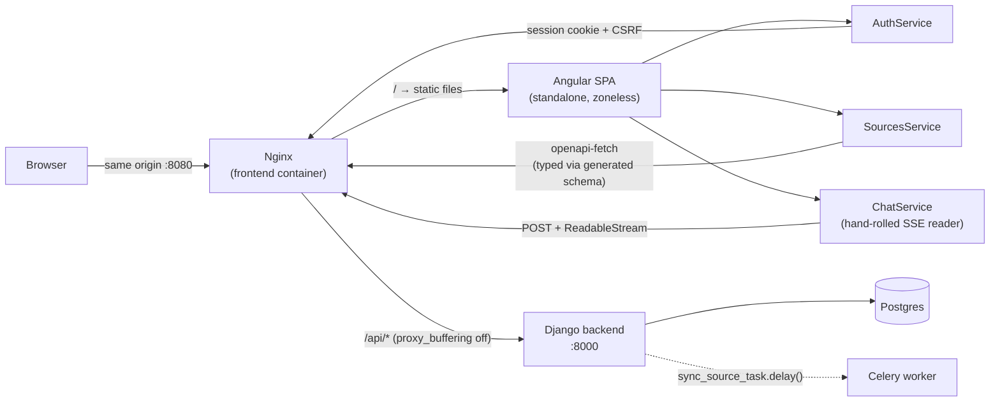

# Lorebase — Roadmap de implementación

> Documento vivo: se actualiza a medida que avanzamos o cambian decisiones.
> Es una re-división más fina de todo el roadmap de `plan-ai-knowledge-platform.md`
> (no solo su Fase 1), e incorpora las correcciones señaladas en la sección
> "Hallazgos" más abajo. La sección 7.1 de ese documento ("Hitos") queda como
> referencia histórica; **las "Etapas" de acá son las que efectivamente se
> están implementando.**

## Estado actual

| Etapa | Estado |
|---|---|
| 0 — `.gitignore` e higiene del repo | ✅ Hecha |
| 1 — Esqueleto del backend con `uv` | ✅ Hecha |
| 2 — Docker Compose y CI | ✅ Hecha |
| 3 — Modelos core (`Workspace`, `User`, `Membership`) | ✅ Hecha |
| 4 — Modelos `Source` y `Document` | ✅ Hecha |
| 5 — Interfaz de conectores y carpeta local | ✅ Hecha |
| 6 — Pipeline de ingestion y modelo `Chunk` | ✅ Hecha |
| 7 — Ingestion asíncrona con Celery | ✅ Hecha |
| 8 — Soporte de PDFs y storage | ✅ Hecha |
| 9 — Embeddings | ✅ Hecha |
| 10 — Módulo de retrieval | ✅ Hecha |
| 11 — Chat con citas verificables | ✅ Hecha |
| 12 — Capa de API | ✅ Hecha |
| 13 — Frontend Angular | ✅ Hecha |
| — Trabajo posterior no planificado | 🔄 En curso (ver abajo) |
| 14 en adelante | Pendiente |

Desde que se cerró la Etapa 13, buena parte del trabajo **no corresponde a
ninguna etapa del plan**: son bugs encontrados usando el sistema con datos
reales y mejoras pedidas sobre la marcha. Ese trabajo se lista en
"[Trabajo posterior a la Etapa 13](#trabajo-posterior-a-la-etapa-13)". Las
notas técnicas de cada cambio siguen viviendo junto a la etapa cuyo código
tocan — es donde sirven para entender por qué ese código es como es — pero
el índice de abajo es lo que dice *qué pasó y cuándo*.

## Deuda técnica y pendientes conocidos

Cosas identificadas y **deliberadamente pospuestas**, no descubiertas después. Se van registrando acá a medida que aparecen, para no perderlas entre las notas de cada etapa.

- **Selección de un único archivo en `LocalFolderConnector`** (surgió en la Etapa 5). Hoy `config["path"]` tiene que ser una carpeta; no hay forma de indexar un archivo puntual de una carpeta que por lo demás no querés indexar entera. Es un caso de uso real, pendiente de implementar. Extenderlo no debería tocar la interfaz `Connector` ni la reconciliación — queda acotado a `LocalFolderConnector.fetch_documents()`.
- **`HeadingChunker` solo fusiona secciones cortas hacia adelante** (surgió en la Etapa 6). El último chunk de un documento puede quedar por debajo de `min_tokens` si es el que sobra al cierre del merge greedy — no hay un segundo paso que lo fusione hacia atrás con el chunk anterior. No es incorrecto (el chunk existe y es citable), solo un candidato más débil para retrieval. El mismo mecanismo tiene un efecto secundario en `heading_path`: si una sección sin heading (ej. el bloque de front matter, que se preserva en el texto — ver el punto de line numbers más abajo) se fusiona hacia adelante con secciones que sí tienen heading, el chunk resultante hereda el `heading_path` vacío de la primera pieza, no el de las secciones que absorbió. Las líneas siguen siendo correctas (la cita abre en el lugar justo), solo el breadcrumb queda menos informativo en ese caso puntual. Si se vuelve un problema real, agregar el paso de fusión hacia atrás es un cambio acotado a `HeadingChunker._merge_short_pieces`.
- **`Chunk.search_vector` usa `config="english"` fijo**, aunque las notas reales sean una mezcla de español e inglés (surgió en la Etapa 6). El stemming y las stopwords de Postgres son específicos de idioma — con `english` fijo, el retrieval léxico sobre texto en español pierde precisión (no matchea "buscando" con "buscar", no filtra stopwords en español). La solución correcta es un config dinámico por documento (columna `language` + detección de idioma), pospuesta hasta ver en la Etapa 16 si el retrieval léxico en español rinde mal en la práctica — la mitad densa del hybrid search (embeddings, multilingües por defecto) compensa bastante mientras tanto.
- **Normalización estructurada de fechas: propuesta, evaluada y pospuesta a propósito** (2026-08, idea del usuario). La propuesta: extraer las fechas **al indexar** a un campo real e indexado (`ArrayField(DateField)` + índice GIN) y parsear la fecha de la pregunta **determinísticamente** (regex + `strptime`), en vez del mecanismo actual (una llamada al LLM en `rewrite_query()` que agrega el ISO, más `content__icontains` sin índice en `DateAwareRetriever`). Ventajas medibles: elimina una llamada al LLM por pregunta y permitiría restaurar el atajo de "no reescribir si no hay historial"; cambia un scan `ILIKE` por un lookup indexado (resuelve la deuda del `icontains`); y alcanzaría formatos hoy invisibles. Análisis real del corpus (2390 chunks) antes de decidir: **2610 fechas ISO, 160 con mes en español, 28 con barras**, o sea ~96% ya está en ISO — el grueso de la ganancia no está en normalizar el formato sino en pasar a un campo estructurado. Riesgos: migración + re-parseo (sin re-embeder), ambigüedad real en `03/04/2025`, y falsos positivos (el análisis capturó `3.11.10`, que es un número de versión). **Decisión: no ahora** — se revisa cuando exista el golden set de la Etapa 16, para poder comparar contra un baseline en vez de a ojo.
- **Ajustes de retrieval por usuario, descartados por ahora** (2026-08): se evaluó un modelo `UserSettings` con estrategia y `top_k` editables desde la UI. Alto valor de aprendizaje, pero implica atravesar la configuración por usuario en todo el camino de query; se prefirió el panel de estado de solo lectura, que es más barato y ataca un problema que ya ocurrió de verdad.
- **Sin selector de workspace en la UI** (surgió en la Etapa 13). `AuthService.primaryWorkspace` toma siempre el primer `Membership` del usuario — el modelo soporta pertenecer a varios workspaces, pero no hay forma de elegir entre ellos desde el frontend. No es un problema hoy (mono-usuario, típicamente un solo workspace real), pero si en algún momento se usan varios, hace falta un switcher.
- ~~**Sin listado ni historial de conversaciones pasadas**~~ (surgió en la Etapa 13, **resuelto en 2026-08**) — ver las notas de la Etapa 13.
- **`openapi-typescript` con `legacy-peer-deps` en `frontend/.npmrc`** (surgió en la Etapa 13): su peer declarado es `typescript@^5.x`, desactualizado contra el TypeScript 6.0 que usa Angular 22. Es una herramienta de build-time nada más, sin riesgo real, pero conviene sacar el override el día que la librería actualice su rango de peers.
- **`DenseRetriever` sigue sin fallback propio si `embed_query()` falla** (surgió arreglando el bug de rate limit de la Etapa 10, después de la Etapa 13) — si ese llamado tira `EmbeddingProviderUnavailableError`, no hay nada que capture la excepción y `HybridRetriever` se cae entero en vez de degradar a la mitad léxica sola. **Con `EMBEDDING_PROVIDER=local` (default actual) este caso ya no depende de un rate limit externo** — sigue siendo una falla teóricamente posible (el modelo no carga, falta memoria, etc.), pero mucho menos probable que un 429 de cuota. Si se vuelve a `voyage` en algún momento, este punto vuelve a ser relevante. Identificado pero no resuelto — queda pendiente si se repite en la práctica.
- **El explorador de carpetas (`/api/sources/browse/`) muestra `storage/documents/`** (surgió al agregarlo, después de la Etapa 13) — la carpeta interna donde se cachean los PDFs subidos (`Document.original_file`), mezclada junto a las carpetas reales de notas del usuario porque ambas viven bajo el mismo `MEDIA_ROOT`. No rompe nada (browse es de solo lectura y no expone nada sensible), pero es ruido visual en el picker. Separar el root de "carpetas para elegir como fuente" del root de "storage interno de la app" lo resolvería, a costa de reubicar dónde vive todo lo ya creado bajo `/app/storage/`.
- **Sin re-chunking automático al cambiar `section_boundary_pattern`** (surgió al agregar el patrón configurable, Etapa 6/10). Cambiar el patrón de un `Source` ya existente vía `PATCH` no dispara un re-ingest — el contenido de los archivos no cambió, así que `sync_source()` no ve nada para reprocesar (la reconciliación decide por `content_hash`, no por config). Hoy hace falta forzarlo a mano (recorrer los documentos y llamar `_ingest()` directo, como se hizo para aplicar el fix real). Sería razonable que cambiar ese campo específico del `config` dispare un re-ingest completo de la fuente automáticamente.
- **`Chunk.search_vector` sigue calculándose solo sobre `content`, sin `heading_path`** (surgió arreglando el hueco de `heading_path`, 2026-08). Los embeddings y el prompt ya usan `content_with_heading`, pero la mitad **léxica** del hybrid search no: su `GeneratedField` indexa únicamente `content`, así que una búsqueda léxica por una fecha no matchea los chunks partidos de esa misma entrada. Arreglarlo es cambiar la expresión a `SearchVector("heading_path", "content", ...)`, lo que implica una migración sobre una columna generada (se recalcula sola para todas las filas). **Medido después, ya con preguntas en inglés: para el caso de fechas no cambiaría nada** — `LexicalRetriever` devuelve 0 resultados para `"What did I do on July 21 2025?"` porque la semántica AND de `websearch_to_tsquery` exige que *todos* los términos matcheen y el contenido guarda `2025-07-21`, no "July". Meter `heading_path` en el índice no arregla ese desencuentro de formato. Sigue siendo deuda válida (mejoraría el léxico en general), pero no es la palanca para el caso de fechas.
- **`DateAwareRetriever` toma sus matches con `LIMIT` pero sin `ORDER BY`** (surgió revisándolo, 2026-08). `qs[:_MAX_DATE_MATCHES]` no tiene `order_by()`, y ni `Chunk.Meta` ni `BaseModel.Meta` definen `ordering` — así que *cuáles* 3 chunks se fuerzan es no determinístico y puede cambiar entre corridas según el plan que elija Postgres. Con un mes entero de entradas mencionando la misma fecha, la selección es efectivamente azarosa. **Corregido** con `.order_by("document__path", "index")` (orden de archivo: determinístico y además el orden natural de lectura de varios chunks del mismo día).
- **`DateAwareRetriever` usa `content__icontains`, no el índice GIN de `search_vector`** (surgió al agregarlo, Etapa 10). Para el volumen actual (miles de chunks, uso personal) un `ILIKE` no indexado no es un problema real, pero no escala igual de bien que el resto del pipeline de búsqueda si el corpus creciera mucho. Si se vuelve un cuello de botella, la solución más simple es extraer la fecha a una columna propia indexada (ej. `Chunk.metadata` con un índice funcional, o un campo `date` dedicado) en vez de buscar la fecha como substring de texto libre.
- **`rewrite_query()` ahora llama al LLM en cada turno, incluso el primero** (surgió arreglando el bug de fechas, Etapa 10/11) — antes se salteaba sin historial. Es un trade-off de costo deliberado (una llamada más a Haiku por conversación nueva), documentado y aceptado, pero vale tenerlo presente si el volumen de uso crece mucho.
- **`EMBEDDING_PROVIDER=fake` quedó activo en `infra/.env` real por un buen tramo de esta sesión**, no solo en tests (surgió revisando el archivo por otro motivo, Etapa 9). No hay forma de saber desde cuándo — probablemente una sesión de debugging anterior lo dejó así. No hay ninguna alerta/chequeo que avise "estás corriendo producción con un provider fake"; sería razonable agregar un check de sanity (ej. un log de warning al arrancar si `DEBUG=False` y algún `*_PROVIDER` está en `fake`) para que esto no vuelva a pasar desapercibido.
- **Lección operativa: `docker compose restart` no relee `env_file`** (surgió activando `EMBEDDING_PROVIDER=local`/`RERANK_PROVIDER=local` en Docker, Etapa 9/10). Las variables de entorno de un contenedor se fijan al *crear* el contenedor, no en cada arranque — `restart` para y vuelve a arrancar el mismo contenedor ya creado, así que cambios en `infra/.env` quedaban invisibles para el proceso aunque el archivo en disco ya estuviera actualizado (`settings.EMBEDDING_PROVIDER` seguía devolviendo `voyage` adentro del contenedor). Hace falta `docker compose up -d` (o `--build` si además cambió una dependencia), que sí recrea el contenedor con el environment nuevo. Verificado entrando al contenedor y leyendo `settings.EMBEDDING_PROVIDER` directamente antes/después.
- **Lección operativa: el disco lleno era el de la VM de Docker Desktop, no el del host** (surgió durante un rebuild con los modelos locales nuevos, Etapa 9/10). El contenedor `db` empezó a fallar con `FATAL: could not write lock file "postmaster.pid": No space left on device` con el Mac mostrando ~90GB libres — Docker Desktop en macOS corre una VM Linux con su propio disco virtual de tamaño fijo, separado del filesystem del host, y ese es el que se llena. `docker system df` mostró ~36.74GB de build cache acumulado (natural: cada intento de modelo — Jina, luego mmarco — dejó capas de imagen nuevas). Se liberó espacio con `docker builder prune -f` (~19.41GB) y `docker image prune -f`, evitando deliberadamente `docker volume rm`/`prune` para no tocar `pgdata` — los 1427 embeddings reales ya calculados sobrevivieron intactos, verificado después del cleanup.

## Context

El objetivo es llevar el diseño de `plan-ai-knowledge-platform.md` a código siguiendo etapas pequeñas y verificables, evitando retrabajo. El plan cubre hasta **Fase 4 + servidor MCP**: un segundo cerebro personal completo (conectores local/PDF/GitHub, hybrid search con reranker, chat con citas verificables, feedback, dashboard, observabilidad y evaluación) más exposición del retrieval vía Model Context Protocol.

### Decisiones de alcance

- **Alcance:** Fases 1–4 del documento + servidor MCP. Fase 5 (ACLs por documento, API pública, webhooks, SDK) queda fuera.
- **Idioma:** todo el código, identificadores, comentarios y documentación técnica en **inglés**. Los textos visibles de la UI también en **inglés**. La conversación con Claude se mantiene en español.
- **Toolchain backend:** `uv` gestionando intérprete (Python 3.13) y dependencias (`pyproject.toml` + `uv.lock`).
- **Testing/CI:** `pytest-django` desde la etapa 1, tests por etapa sobre la lógica de negocio, GitHub Actions con lint + tests desde temprano.

---

## Hallazgos previos al plan

Esto es lo que surgió al analizar el documento de diseño y el entorno antes de arrancar a codear. Cada punto ya está incorporado en las etapas correspondientes.

### Bloqueantes de entorno (verificados en esta máquina)

| Problema | Detalle | Solución en el plan |
|---|---|---|
| **Python 3.9.1** en el host | Django 6.1 requiere Python 3.12+ | `uv python install 3.13`, misma versión en la imagen Docker (Etapa 1) |
| **Node 25.8.1** en el host | Angular CLI 22 declara `node: ^22.22.3 \|\| ^24.15.0 \|\| >=26.0.0`. **25.x no está soportado** y el CLI va a fallar o advertir | Fijar **Node 24 LTS** con `.nvmrc` en `frontend/` (Etapa 13) |
| `uv` no instalado | — | Paso explícito en Etapa 1 |

### Errores y contradicciones en el documento de diseño

1. **`latency_ms` y `cost` colgando de `Feedback` (§4.11) es un error de modelado.** Esas métricas existen para *toda* respuesta, no solo para las que reciben pulgar arriba/abajo. Si viven en `Feedback`, el dashboard de costos solo ve los mensajes calificados. → Van en `Message` (o una tabla `MessageMetrics` 1--1); `Feedback` guarda solo `rating` + `comment`.
2. **`Workspace 1--N User` (§4.11) cierra la puerta al multi-workspace de Fase 5.** Un usuario quedaría atado a un único workspace. → Tabla `Membership(user, workspace, role)` desde el día uno. Es gratis ahora y caro después (migración de datos + reescritura de todos los querysets).
3. **El "keyword search placeholder" del Hito 7 es retrabajo evitable.** El documento lo asume descartable, pero no hace falta: la búsqueda léxica de Postgres (`tsvector` + `websearch_to_tsquery` + `ts_rank`) **ya es la mitad léxica del hybrid search final**. → La primera implementación de retrieval se escribe con la interfaz definitiva (`Retriever`), y la Fase 2 solo suma la mitad densa y la fusión. Cero código tirado.
4. **Agregar pgvector tarde obliga a una migración + reindexado completo.** La dimensión del vector se fija al crear la columna. → La extensión `vector` y la columna `Chunk.embedding` (nullable) entran en la **primera** migración de `Chunk`, aunque los embeddings se calculen recién en la Etapa 9.
5. **Contradicción de alcance de conectores:** §2.1 pone Notion/Confluence/Drive "dentro del MVP" pero §7 los manda a Fase 3. → Se respeta el roadmap: MVP = carpeta local + PDF + GitHub.
6. **Contradicción en el flujo de consulta:** §5 dibuja "el LLM decide qué buscar" (retrieval agéntico con tool use) mientras §4.12 describe retrieval directo. → MVP con retrieval directo + query rewriting; el retrieval agéntico se evalúa como mejora *medible* en la Etapa 16, no a ciegas.
7. **"Citations obligatorias" no tiene mecanismo, solo intención.** Pedirlas en el prompt no las garantiza. → El LLM devuelve salida estructurada con `chunk_id`s vía tool use, y el servidor **valida que cada id citado estuviera realmente en el contexto** antes de persistir la respuesta. Una cita que no valida se descarta. Esto es lo que hace que las citas sean verificables por construcción y no una promesa del prompt.
8. **`StorageProvider` propio (§4.6) es código innecesario.** Django ya trae una API de storages pluggable (setting `STORAGES` + `django.core.files.storage`). Migrar a Garage/S3 después es instalar `django-storages` y cambiar un setting. → Se usa la de Django.
9. **Soft delete sin purga de índice.** `Document.deleted = True` deja los `Chunk` vivos y siguen apareciendo en retrieval. → Borrado físico de chunks al marcar el documento como borrado; el `Document` queda como tombstone.
10. **Faltantes no mencionados en el documento:** estrategia de tests, CI, gestión de configuración/secretos, `.env.example`, esquema OpenAPI, diseño del streaming (DRF no lo maneja bien), y locking de jobs de sync concurrentes sobre la misma fuente. Todo cubierto en las etapas.
11. **Naming inconsistente:** el repo y el README dicen `lorebase`; el wireframe dice "Cuaderno". → Se adopta **Lorebase** en todo (marca de UI incluida).
12. **`.gitignore` con patrones sin anclar.** `lib/`, `var/`, `build/`, `dist/`, `target/` vienen de la plantilla Python y matchean *cualquier* directorio con ese nombre a cualquier profundidad: van a ignorar silenciosamente carpetas legítimas del frontend Angular (`frontend/src/app/lib/`, por ejemplo). → Se anclan a la raíz o a `backend/`.

### Elecciones técnicas que el documento dejó abiertas

- **Parser de PDF:** `pymupdf4llm`, que extrae **a Markdown**. Así el PDF entra al *mismo* chunker que las notas: un solo camino de código en vez de dos.
- **Reranker:** Voyage (mismo vendor que embeddings ⇒ una sola API key y un solo cliente).
- **Auth SPA:** sesión de Django con cookies `SameSite` (mismo origen detrás del reverse proxy). Evita toda la lógica de refresh de tokens del MVP.
- **Streaming:** DRF para el CRUD; el endpoint de chat es una vista Django async con `StreamingHttpResponse` (SSE), fuera de DRF.
- **Cliente API tipado:** `drf-spectacular` genera OpenAPI y de ahí se genera el cliente TypeScript de Angular. Elimina el mantenimiento manual de modelos duplicados.

---

## Convenciones del proyecto

- Código, identificadores, comentarios, documentación técnica y textos de UI: **inglés**.
- Python: `ruff` (lint + format), `mypy` en modo gradual sobre `core/` y `rag/`.
- TypeScript: ESLint + Prettier, strict mode.
- Commits: título corto en modo imperativo (sin prefijo `feat:`/`chore:`), sin cuerpo salvo que agregue algo que el diff no explique.
- Toda etapa termina con tests verdes y CI en verde.

## Stack fijado

| Capa | Elección | Versión verificada |
|---|---|---|
| Runtime backend | Python | 3.13 |
| Framework | Django + DRF | 6.1 / 3.17 |
| Workers / broker | Celery + Redis | 5.6 |
| Base de datos | PostgreSQL + pgvector | 17 / `pgvector` 0.5 |
| Búsqueda léxica | Postgres FTS (`tsvector`) | nativo |
| Embeddings + rerank | Voyage AI | `voyageai` 0.5 |
| LLM | Anthropic | `anthropic` 0.120 |
| PDF | `pymupdf4llm` | 1.28 |
| Config | `django-environ` | 0.14 |
| Esquema API | `drf-spectacular` | 0.30 |
| Frontend | Angular (Node 24 LTS) | 22.1 |
| Contenedores | Docker Compose | v5 |

> Los identificadores exactos de modelo de Voyage y Anthropic se confirman contra la documentación del proveedor al llegar a las Etapas 9 y 11. Se exponen como settings (`EMBEDDING_MODEL`, `EMBEDDING_DIM`, `RERANK_MODEL`, `LLM_MODEL`), nunca hardcodeados.
>
> **Actualización Etapa 9:** confirmado contra `docs.voyageai.com` — el modelo de embeddings vigente es `voyage-4` (no `voyage-3`, que quedó legacy), dimensión por defecto 1024 (coincide con lo que ya habíamos fijado en la Etapa 6), $0.06 por millón de tokens con 200M gratis. `RERANK_MODEL`/`LLM_MODEL` siguen pendientes de confirmar en sus etapas correspondientes.

## Estructura del repositorio

```
lorebase/
├── backend/
│   ├── pyproject.toml, uv.lock, Dockerfile, manage.py
│   ├── config/                 # settings/, urls, celery, asgi/wsgi
│   ├── core/                   # Workspace, User, Membership
│   ├── sources/                # Source, Document, connectors/
│   ├── ingestion/              # parsers/, chunking/, pipeline, tasks
│   ├── rag/                    # embeddings/, retrieval/, llm/, chat
│   ├── analytics/              # Feedback, metrics, dashboard
│   ├── mcp_server/             # servidor MCP (Etapa 17)
│   └── tests/
├── frontend/                   # workspace Angular, .nvmrc
├── infra/                      # docker-compose.yml, .env.example, init scripts
├── docs/                       # el plan de diseño + roadmap + ADRs
└── .github/workflows/
```

---

## Roadmap

Las etapas son secuenciales salvo donde se indique. Cada una es un PR.

---

### Bloque A — Fundaciones

#### Etapa 0 — `.gitignore` e higiene del repo ✅

**Objetivo:** que ningún artefacto generado, secreto o archivo de sistema pueda entrar al repo, antes de escribir la primera línea de código.

**Tareas** (en orden):
1. **Anclar** los patrones de packaging Python que hoy están sueltos, para que no pisen carpetas del frontend: `/backend/build/`, `/backend/dist/`, `/backend/lib/`, `/backend/var/`, `/backend/target/`, `/backend/share/python-wheels/`.
2. Agregar **Node/Angular**: `node_modules/`, `frontend/dist/`, `.angular/`, `frontend/coverage/`, `*.tsbuildinfo`, `.eslintcache`.
3. Agregar **macOS/IDE**: `.DS_Store` (hoy aparece sin trackear en `git status`), `._*`, `.idea/`, `.vscode/*` con excepción `!.vscode/extensions.json`.
4. Agregar **Docker/infra**: `infra/data/`, `*.local.yml`.
5. Agregar **runtime de Django**: `/backend/media/`, `/backend/staticfiles/`, `/backend/storage/` (cache de PDFs originales).
6. Agregar **variantes de entorno** manteniendo el ejemplo: `.env.*` + `!.env.example`.
7. Confirmar que `uv.lock` **NO** se ignora (la plantilla lo trae comentado; se versiona).
8. Agregar `.dockerignore` en `backend/` y `frontend/`.
9. Reescribir `README.md`: qué es Lorebase, stack, arranque rápido.
10. Mover el documento de diseño y el wireframe a `docs/`, versionados.

**Dependencias:** ninguna.
**Hecho cuando:** `git status --ignored` no lista ningún archivo generado como trackeable; `git check-ignore -v .DS_Store` acierta; `git check-ignore backend/uv.lock` no matchea.

---

#### Etapa 1 — Esqueleto del monorepo y toolchain del backend ✅

**Objetivo:** un proyecto Django que arranca, con dependencias reproducibles, lint y tests configurados.

**Tareas:**
1. Instalar `uv`; `uv python install 3.13`.
2. `backend/pyproject.toml` con Django, DRF, `django-environ`, `psycopg[binary]`, `celery[redis]`, y grupo dev (`pytest`, `pytest-django`, `pytest-cov`, `ruff`, `mypy`, `factory-boy`).
3. `django-admin startproject config backend/` con settings dividido: `config/settings/{base,dev,test,prod}.py`, todos los secretos vía `django-environ`.
4. `infra/.env.example` con cada variable documentada y sin valores reales.
5. `pytest.ini`/`pyproject` con `DJANGO_SETTINGS_MODULE=config.settings.test`; un test smoke.
6. `ruff` + `mypy` configurados; `Makefile` con `make lint test migrate run`.

**Dependencias:** Etapa 0.
**Hecho cuando:** `make lint` y `make test` pasan en verde; `uv sync` reproduce el entorno desde cero; ningún secreto en el código.

---

#### Etapa 2 — Docker Compose y CI ✅

**Objetivo:** infraestructura local levantable con un comando y pipeline de CI operativo.

**Tareas:**
1. `infra/docker-compose.yml`: `db` (imagen `pgvector/pgvector:pg17`), `redis`, `backend`, `worker`. Volúmenes nombrados, healthchecks.
2. `backend/Dockerfile` multi-stage sobre Python 3.13, instalando con `uv`.
3. Script de init de Postgres que ejecuta `CREATE EXTENSION IF NOT EXISTS vector;` — en la base de la app **y en `template1`** (para que la base de test de Django, creada a partir de `template1`, también la herede).
4. Cablear Celery (`config/celery.py`) contra Redis; una task `ping` de prueba.
5. `.github/workflows/ci.yml`: servicios postgres+redis, `ruff check`, `mypy`, `pytest --cov`.

**Dependencias:** Etapa 1.
**Hecho cuando:** `docker compose up` deja los 4 servicios healthy; la task `ping` se ejecuta en el worker; el CI corre verde en un PR.

**Notas de la implementación real:**
- El puerto 5432 del contenedor `db` se publica como **5434** en el host: había un Postgres nativo de macOS ya escuchando en 5432, ajeno al proyecto.
- La secret key de Django no puede generarse con `get_random_secret_key()` para un `.env` que lee Docker Compose: su charset incluye `$`, que Compose interpreta como referencia a otra variable (`${VAR}`) y lo corrompe en silencio. Se usa `secrets.token_urlsafe()` en su lugar.
- `astral-sh/setup-uv` no publica tags flotantes por versión mayor (`v9`) como sí hace `actions/checkout` — hay que pinearlo a la versión exacta (`v9.0.0`).

---

### Bloque B — Dominio e ingestion

#### Etapa 3 — Modelos core ✅

**Objetivo:** base multi-tenant correcta desde el inicio, aunque hoy sea mono-usuario.

**Tareas:**
1. App `core`: `User` custom (`AbstractUser`, **obligatorio hacerlo antes de la primera migración**), `Workspace`, `Membership(user, workspace, role)` — ver hallazgo 2.
2. Modelo base abstracto con `id` UUID, `created_at`, `updated_at`.
3. Registro en Django Admin.
4. Factories de `factory-boy` + tests de las reglas de membresía.

**Dependencias:** Etapa 2.
**Hecho cuando:** migraciones aplican en limpio; se puede crear un superusuario y ver las tres entidades en el admin; tests verdes.

> Riesgo: sustituir `AUTH_USER_MODEL` después de la primera migración es doloroso. Por eso esta etapa va antes que cualquier otro modelo.

**Notas de la implementación real:**
- `User` hereda tanto `AbstractUser` como el `BaseModel` propio, para que **toda** entidad del schema (`User` incluido) use UUID como PK — importa para la Etapa 12, donde la API expone IDs de forma consistente.
- El riesgo del recuadro de arriba se concretó: la base de Docker ya tenía migraciones de `auth`/`admin`/`sessions` aplicadas desde la Etapa 2 (con el `User` default de Django, PK entero). Cambiar `AUTH_USER_MODEL` después de eso no reescribe ese DDL ya aplicado. Se resolvió reseteando la base de dev (`DROP DATABASE` + `CREATE DATABASE`) y migrando de cero — válido porque no había datos reales, y confirma que el fix de `template1` de la Etapa 2 no hay que repetirlo: la base nueva heredó `vector` sola.
- `tests/` quedó excluido de `mypy`: `factory_boy` arma sus factories con metaclases que devuelven instancias del modelo en runtime, algo que mypy no puede inferir (ve el tipo `SomeFactory`, no el modelo real). El plan ya scopeaba mypy a `core/`/`rag/` en modo gradual, así que la exclusión es consistente, no una concesión nueva.

---

#### Etapa 4 — Modelos `Source` y `Document` ✅

**Objetivo:** representar fuentes y documentos con soporte de reindexado incremental.

**Tareas:**
1. `Source`: `workspace`, `name`, `type` (choices), `config` (JSONField), `status`, `last_synced_at`, `last_error`.
2. `Document`: `source`, `external_id`, `path`, `title`, `content_hash`, `version`, `deleted`, `metadata` (JSONField). Unique en `(source, external_id)`.
3. Índices sobre `(source, content_hash)` y `(source, deleted)`.
4. Admin con filtros por fuente y estado.

**Dependencias:** Etapa 3.
**Hecho cuando:** se pueden crear fuentes y documentos desde el admin; el constraint de unicidad se verifica con un test.

**Notas de la implementación real:**
- `Source.type` por ahora solo tiene `local_folder` y `github` como choices (lo único planificado hasta la Etapa 14); sumar un conector nuevo es agregar un valor acá **y** su implementación en el registry de la Etapa 5, no tocar el modelo de datos.
- El constraint de unicidad es `(source, external_id)`, no `external_id` global — un mismo `external_id` puede repetirse entre fuentes distintas sin problema (cubierto por test explícito).

---

#### Etapa 5 — Interfaz de conectores y conector de carpeta local ✅

**Objetivo:** la abstracción plugin-first funcionando, validada con el primer conector real.

**Tareas** (en orden):
1. `sources/connectors/base.py`: ABC `Connector` con `validate_config()`, `test_connection()`, `fetch_documents() -> Iterator[RawDocument]`. `RawDocument` es un dataclass (`external_id`, `path`, `title`, `content` o `binary`, `metadata`).
2. `sources/connectors/registry.py`: registro por `source.type` mediante decorador; resolución de la implementación en runtime.
3. `LocalFolderConnector`: recorre el directorio, lee `.md`, parsea front-matter YAML, calcula hash del contenido.
4. Reconciliación: comparar el conjunto entrante contra los `Document` existentes → altas / cambios (hash distinto) / bajas (ausentes ⇒ `deleted=True`).
5. `manage.py sync_source <id>` (síncrono todavía).
6. Tests con un directorio temporal: alta, modificación, borrado, y **no-op cuando nada cambió**.

**Dependencias:** Etapa 4.
**Hecho cuando:** correr el comando dos veces seguidas sin tocar archivos no genera ninguna escritura; agregar/editar/borrar un `.md` se refleja correctamente; tests verdes.

**Notas de la implementación real:**
- `RawDocument.content_hash` es un campo explícito del dataclass, no algo que la reconciliación calcule — cada conector lo genera como mejor le convenga (sha256 del archivo para `local_folder`; será el SHA de git para GitHub en la Etapa 14). La reconciliación solo compara strings, nunca sabe cómo se generaron.
- **Bug real encontrado y corregido:** el registro de conectores (`@register_connector`) es un efecto secundario de *importar* el módulo del conector. Sin nada que fuerce esa importación, `sync_source()` fallaba con `No connector registered` en cualquier proceso donde nadie hubiera importado `local_folder.py` antes — lo cual incluía el comando `manage.py sync_source` real, no solo un test aislado. Se resolvió importando los conectores desde `SourcesConfig.ready()`, el hook de Django pensado exactamente para este tipo de registro-al-arrancar.
- La reconciliación también contempla "revivir" un `Document` soft-deleted cuyo archivo vuelve a aparecer — sin este caso, se violaba el constraint de unicidad `(source, external_id)` al intentar crear un duplicado. Cubierto con test explícito.
- Selección de un archivo único (en vez de una carpeta entera) quedó **pendiente**, a pedido explícito: es un caso real para el uso personal, pero se prefirió no anticiparlo sin necesidad inmediata. Extenderlo más adelante no debería tocar la interfaz `Connector` ni la reconciliación — es un cambio acotado a `LocalFolderConnector.fetch_documents()`.
- **Guarda de tamaño máximo** (agregada después, al arrancar la Etapa 7, pero pertenece acá): todo el pipeline de parsing/chunking trabaja en memoria, sin streaming. `LocalFolderConnector` ahora chequea `file_path.stat().st_size` **antes** de leer el archivo, y salta (con warning en el log) cualquiera que supere `settings.MAX_DOCUMENT_SIZE_BYTES` (10 MB por defecto) — para no arriesgar cargar algo patológicamente grande completo en RAM solo para descartarlo después.
- **Soporte de `.txt` agregado después, a pedido explícito** (2026-08, feedback real de uso): `LocalFolderConnector` reconoce `.md` y `.txt` con el mismo método (renombrado de `_read_markdown` a `_read_text_file`) — un `.txt` sin ningún heading Markdown ya era un caso 100% soportado por el pipeline (una nota sin headings se trataba, correctamente, como una única sección headingless), así que extender la detección de extensión fue el único cambio real necesario.
- **Deduplicación de contenido idéntico, agregada después, a pedido explícito** (2026-08, encontrado en uso real: dos archivos `todo1.md`/`todo2.md` con contenido byte-idéntico, ambos indexados por separado). `sources/sync.py` ahora busca, antes de parsear/chunkear, si ya existe otro `Document` no borrado en la misma fuente con el mismo `content_hash`; si lo hay, el archivo nuevo se registra igual (existe de verdad) pero se deja sin chunks propios, con `metadata.duplicate_of` apuntando al documento canónico (el más antiguo por `created_at`, con `external_id` como desempate — necesario porque `(source, external_id)` ya garantiza que ese desempate nunca da igualdad, así que el resultado es siempre determinístico). **Bug real encontrado en el propio desarrollo del fix:** la primera versión comparaba "¿existe otro documento con este hash?" sin verificar que ese *otro* documento fuera realmente más antiguo — al re-procesar dos duplicados ya existentes en la misma pasada, cada uno encontraba al otro como candidato y ambos terminaban marcados como duplicado del otro (0 chunks los dos). Se corrigió (a) exigiendo que el candidato sea genuinamente anterior, no solo "otro", y (b) excluyendo documentos que ya estén marcados como `duplicate_of` de la búsqueda de candidatos — cubierto con un test de regresión dedicado que reproduce exactamente ese reprocesamiento.

---

#### Etapa 6 — Pipeline de ingestion y modelo `Chunk` ✅

**Objetivo:** convertir documentos en chunks consultables, con el esquema de búsqueda ya listo para las dos mitades del hybrid search.

**Tareas** (en orden):
1. `ingestion/parsers/base.py` (ABC `Parser`) + `MarkdownParser` → texto limpio conservando la jerarquía de encabezados.
2. `ingestion/chunking/`: `HeadingChunker` (por encabezado, con merge de secciones cortas y split de las largas por tokens). Interfaz `Chunker` para poder alternar estrategias.
3. Modelo `Chunk`: `document`, `index`, `content`, `heading_path`, `start_line`, `end_line`, `token_count`, `metadata`, **`embedding` (`VectorField`, nullable) y `search_vector` (`SearchVectorField`)** — ver hallazgo 4. Migración con `CREATE EXTENSION vector`, índice GIN sobre `search_vector` e índice HNSW sobre `embedding`.
4. `search_vector` poblado por trigger o por `SearchVector` en el save del pipeline.
5. `ingestion/pipeline.py`: `document → parse → chunk → persist`. En cambio de hash: **reemplazar todos los chunks del documento**. En `deleted=True`: **borrado físico de sus chunks** (hallazgo 9).
6. Tests: chunking de notas cortas y largas, exactitud de `start_line`/`end_line` (las citas dependen de esto), y purga de chunks al borrar.

**Dependencias:** Etapa 5.
**Hecho cuando:** un directorio real de notas produce chunks con line ranges correctos; reindexar sin cambios no reescribe nada; borrar una nota elimina sus chunks; `search_vector` poblado en todos.

**Notas de la implementación real:**
- `ParsedSection`/chunking nunca reconstruyen texto concatenando fragmentos — todo se expresa como rangos `(start_line, end_line)` sobre el texto original, y el contenido siempre se obtiene con un slice directo. Es deliberado: las citas dependen de números de línea exactos, y reconstruir texto a partir de fragmentos copiados es exactamente cómo aparecen los bugs de off-by-one.
- `search_vector` se implementó con `models.GeneratedField` (Postgres 12+/Django 5+), no con un trigger manual ni con un `.update()` en el pipeline — la columna se recalcula sola, adentro de la base, con la garantía de la propia base de datos de que nunca queda desincronizada de `content`.
- `config="english"` fijo para `search_vector`, aunque las notas reales sean español + inglés mezclado — ver "Deuda técnica" más arriba.
- **Bug real encontrado y corregido:** `LocalFolderConnector` pasaba `post.content` (con el front matter YAML ya extraído por `python-frontmatter`) en vez del texto completo del archivo. Eso desplazaba todos los números de línea calculados respecto al archivo real en disco — una cita a "línea 5" podía en realidad estar en la línea 9 si el archivo tenía 4 líneas de front matter arriba. Se corrigió pasando el texto completo (front matter incluido) al parser, y usando `frontmatter.loads()` solo para extraer metadata/título, nunca para recortar el contenido.
- La integración quedó en `sources/sync.py`, no como un paso separado: `sync_source()` ahora también dispara `ingestion.pipeline.process_document()` para altas/cambios y `purge_chunks_for_documents()` para bajas, usando el contenido que el conector ya trajo en memoria (sin releer el archivo).
- **Bug real de retrieval, encontrado en uso real y corregido después** (2026-08): un archivo de journal diario (`daily.md`, ~20.000 líneas, ~700 entradas) no usa ningún heading Markdown — cada entrada arranca con una línea de fecha suelta (`2023-05-15 12:16:25-0300`). Sin ningún heading, `MarkdownParser` trataba el archivo entero como **una sola sección sin fecha**, y `HeadingChunker` la cortaba puramente por presupuesto de tokens, sin ningún límite alineado a los días — un chunk podía mezclar el final de un día con el principio del siguiente. Como `heading_path` nunca se propaga al embedding, al `search_vector` ni al prompt del LLM (`rag/chat/prompting.py` solo usa `chunk.content`), no había manera de que el retrieval ni el LLM supieran "esto es del día X". Preguntar por una fecha puntual devolvía texto sin relación real a esa fecha, y el LLM ofrecía fechas al azar de lo que sí había recibido — que tampoco eran las preguntadas cuando se insistía.

  La solución fue generalizar `MarkdownParser` en vez de hardcodear un formato de fecha: acepta un `extra_boundary_pattern` (regex) opcional que trata cualquier línea que matchee como un límite de sección informal, igual que un heading — sin nesting (un log plano no tiene jerarquía), con un grupo nombrado `label` opcional para elegir qué texto queda como `heading_path`. El patrón se guarda en `Source.config["section_boundary_pattern"]` (validado como regex válida en el serializer antes de guardar) y se pasa a través de `sources/sync.py` → `ingestion/pipeline.py`. Como la línea de fecha queda **incluida** como primera línea del chunk (mismo comportamiento que ya tenía un heading ATX), no hizo falta tocar embeddings, `search_vector` ni el prompt — la fecha ya viaja como texto real dentro de `content`, que es lo único que esas tres capas leen.

  Verificado con datos reales (no solo tests): tras aplicar `^(?P<label>\d{4}-\d{2}-\d{2})[ T]\d{2}:\d{2}:\d{2}.*$` a la fuente real y resincronizar (807 chunks, cada uno con su fecha), preguntar por dos fechas puntuales distintas devolvió respuestas correctas con citas exactas a las líneas de esa fecha — antes de esto, ambas preguntas fallaban con "no tengo información de ese día".

---

#### Etapa 7 — Ingestion asíncrona con Celery ✅

**Objetivo:** que las sincronizaciones corran en background, con estado observable y sin pisarse entre sí.

**Tareas:**
1. Task `sync_source(source_id)` envolviendo el pipeline.
2. **Lock por fuente** vía Redis, para que dos syncs concurrentes de la misma `Source` no se pisen (hallazgo 10).
3. Modelo `SyncRun`: `source`, `started_at`, `finished_at`, `status`, contadores (added/updated/deleted), `error`.
4. Actualización de `Source.status` y `last_error`; reintentos con backoff.
5. Tests con `CELERY_TASK_ALWAYS_EAGER` + un test de contención del lock.

**Dependencias:** Etapa 6.
**Hecho cuando:** encolar un sync desde el shell lo ejecuta en el worker y produce un `SyncRun` con contadores correctos; el segundo sync concurrente sobre la misma fuente no arranca.

**Notas de la implementación real:**
- La lógica se separó en tres capas para que sea testeable sin depender de Celery: `sync_source()` (reconciliación pura, Etapa 5), `sync_source_with_tracking()` (agrega el `SyncRun` y el estado de `Source`, sigue sin saber nada de Celery) y `sync_source_task` (la task en sí, solo agrega el lock y `autoretry_for`/`retry_backoff`). El management command y la task comparten exactamente el mismo lock y la misma función de tracking — no hay dos caminos con comportamiento distinto según se dispare a mano o desde un worker.
- El lock usa `cache.add()` de Django (backend nativo de Redis, sin paquete extra desde Django 4) — es un `SET NX` atómico: solo el primero en pedirlo lo consigue.
- Redis quedó separado en dos índices de base de datos: `/0` para el broker de Celery, `/1` para el cache (el lock). No hacía falta por corrección (las claves no chocan), pero mantiene separados dos usos distintos del mismo Redis.
- **Gotcha real encontrado en Docker:** el volumen nombrado `backend_venv` (pensado para no pisar el entorno del contenedor con el bind-mount de código, ver Etapa 2) persiste *entre* reconstrucciones de imagen — así que había quedado con el `.venv` de antes de agregar `pgvector`/`tiktoken`/`python-frontmatter`, y el contenedor `backend` estaba `unhealthy` por `ModuleNotFoundError`. Hubo que borrar ese volumen a mano (`docker volume rm infra_backend_venv`) para que se repoblara desde la imagen nueva. Vale la pena recordarlo: **cualquier cambio de dependencias exige resetear ese volumen**, no alcanza con `--build`.
- Otro gotcha de Docker: el worker corre *adentro* del contenedor, que no tiene montado `/tmp` del host — solo `backend/` (como `/app`). Verificar contra una fuente `local_folder` desde el worker real requiere que la carpeta viva dentro de `backend/` (mapea a una ruta válida en ambos lados), no en cualquier lado del host.

---

#### Etapa 8 — Soporte de PDFs y storage ✅

**Objetivo:** ingerir PDFs reutilizando el mismo pipeline, guardando el original para poder citarlo.

**Tareas:**
1. `PdfParser` con `pymupdf4llm` → **Markdown**, reutilizando el `HeadingChunker` existente (hallazgo/elección arriba).
2. Storage vía el setting `STORAGES` de Django (backend filesystem en `backend/storage/`) — **no** una interfaz propia (hallazgo 8).
3. `Document.original_file` (`FileField`) para el binario cacheado.
4. `LocalFolderConnector` extendido para detectar `.pdf` además de `.md`; selección de parser por extensión.
5. Metadata de página en los chunks de PDF, para que la cita apunte a página además de línea.
6. Tests con un PDF fixture chico.

**Dependencias:** Etapa 6 (puede ir en paralelo con la 7).
**Hecho cuando:** un PDF ingerido produce chunks con número de página; el original queda en storage; el mismo chunker sirvió a ambos formatos.

**Notas de la implementación real:**
- No hay una clase `PdfParser` que implemente la interfaz `Parser` — un PDF es binario y produce *varios* textos (uno por página), no uno solo, así que no encaja en `Parser.parse(text) -> list[ParsedSection]`. En su lugar, `extract_pdf_pages()` (en `ingestion/parsers/pdf.py`) solo convierte el PDF a una lista de strings Markdown, uno por página, y cada página pasa por el **mismo** `MarkdownParser` + `HeadingChunker` que cualquier nota — verificado generando un PDF real con `pymupdf` e inspeccionando la forma exacta que devuelve `pymupdf4llm.to_markdown(..., page_chunks=True)`, en vez de confiar en memoria sobre su API.
- El número de página se etiqueta **desde afuera**: se agregó `ChunkData.metadata` (vacío por defecto) para que la orquestación de PDFs pueda taggear `{"page": N}` sobre los chunks que ya devolvió el chunker, sin que `Parser` ni `Chunker` necesiten saber que los PDFs existen.
- `process_document()` pasó a ser keyword-only (`text=` o `binary=`, exactamente uno) — reemplaza el `assert raw_document.content is not None, "binary documents aren't supported yet"` que habíamos dejado a propósito en la Etapa 5 como costura para este momento.
- El binario original se cachea vía `document.original_file.save(...)`, con el path namespaced por fuente (`documents/<source_id>/<filename>`) para que dos fuentes distintas no choquen si tienen un archivo con el mismo nombre.
- **Gotcha de Docker repetido:** volver a `uv add` (esta vez `pymupdf4llm`) dejó el volumen `backend_venv` desactualizado otra vez — mismo síntoma que en la Etapa 7 (`ModuleNotFoundError`), mismo fix (`docker volume rm infra_backend_venv` + rebuild). Ya es un patrón: **toda dependencia nueva exige resetear ese volumen**, no hay forma de evitarlo con la arquitectura actual del bind-mount.

---

### Bloque C — Retrieval y chat

#### Etapa 9 — Embeddings ✅

**Objetivo:** vectorizar chunks detrás de una interfaz intercambiable.

**Tareas:**
1. `rag/embeddings/base.py`: ABC `EmbeddingProvider` con `embed_documents()`, `embed_query()`, `dimensions`.
2. `VoyageEmbeddingProvider` con batching, retry y rate limiting. Modelo y dimensión desde settings.
3. `FakeEmbeddingProvider` determinístico para tests (sin llamadas de red en CI).
4. Paso de embedding integrado en el pipeline + task `backfill_embeddings` para chunks pendientes.
5. Tracking de costo por llamada de embedding.

**Dependencias:** Etapa 6.
**Hecho cuando:** todos los chunks tienen embedding no nulo; el CI corre sin API key gracias al provider fake; cambiar de provider es una línea de settings.

**Notas de la implementación real:**
- **Verificado contra la documentación real de Voyage** (`docs.voyageai.com`), no asumido: el modelo vigente es `voyage-4` (no `voyage-3`, que quedó legacy), 1024 dimensiones por defecto — coincide con lo que ya habíamos fijado en la Etapa 6 — y $0.06/millón de tokens con 200M gratis. `input_type` funciona anteponiendo un prompt en lenguaje natural al texto (`"Represent the query for retrieving supporting documents:"` vs `"Represent the document for retrieval:"`) — el mismo mecanismo que el prefijo manual de los modelos open-source (BGE/E5), solo que automatizado.
- **`tenacity` se sacó como dependencia directa**: inspeccionando el SDK de Voyage se confirmó que ya trae reintentos con backoff exponencial + jitter incorporados (`Client(max_retries=N)`), cubriendo `RateLimitError`/`ServiceUnavailableError`/`Timeout`. Sumar nuestro propio wrapper hubiera sido duplicar lógica. `tenacity` sigue disponible como dependencia transitiva de `voyageai`.
- **El batching sí lo hace nuestro código**, no el SDK: `Client.embed()` manda toda la lista de textos en un solo request, sin trocear. `VoyageEmbeddingProvider` usa `voyageai.VOYAGE_EMBED_BATCH_SIZE` (128, la constante real del SDK) para particionar.
- **El costo no se hardcodeó como número inventado.** `EMBEDDING_COST_PER_MILLION_TOKENS_USD` no tiene default — si no está configurado, se loguean los tokens sin estimar costo en dólares. El número real ($0.06) quedó documentado como referencia verificada, no como default silencioso que se desactualiza solo.
- **El backfill de embeddings quedó desacoplado del pipeline de ingestion**, no integrado adentro de `process_document()`: se batchea mejor a nivel de *todos* los chunks pendientes de una fuente (o del sistema entero) que a nivel de un documento a la vez, que casi siempre tiene muy pocos chunks. `sync_source_task` encadena `backfill_embeddings_task.delay()` al final, como task separada — así un embedding lento o con rate limit no bloquea que la sync se reporte terminada, y se puede reintentar independiente de la sync.
- Verificado con Docker real (no solo `CELERY_TASK_ALWAYS_EAGER` de los tests): las dos tasks (`sync_source_task` y `backfill_embeddings_task`) aparecen como IDs distintos en los logs del worker, encadenadas sobre el broker real.
- **Bug de configuración real, encontrado después** (2026-08, revisando `infra/.env` por otro motivo): `EMBEDDING_PROVIDER=fake` estaba activo en el entorno Docker real, no solo en tests — probablemente quedó de una sesión de debugging anterior y nunca se revirtió. Esto significa que **todo el retrieval denso corrió sobre vectores pseudo-aleatorios** (`FakeEmbeddingProvider` semilla su vector del hash SHA256 del texto — determinístico, pero sin ninguna relación semántica real) hasta que se encontró y corrigió. Impacto real en los hallazgos de esta sesión: el diagnóstico de "los embeddings solos no distinguen bien entre entradas similares" (ver nota de la Etapa 10 sobre `DateAwareRetriever`) se hizo *mientras* este bug estaba activo — quedó confirmado que fallar era inevitable con vectores random, no una conclusión válida sobre la calidad real de los embeddings de Voyage. El fix (`DateAwareRetriever`) sigue siendo correcto y necesario de todas formas, porque no depende de embeddings en absoluto. Los 1427 embeddings ya calculados (todos falsos) se limpiaron (`embedding=NULL`) y se recalcularon con Voyage real.
- **Segundo bug real, encontrado re-corriendo el backfill con embeddings reales:** igual que el reranker (ver nota de la Etapa 10 sobre el 500 de rate limit), `VoyageEmbeddingProvider` no traducía `RateLimitError`/`ServiceUnavailableError`/`Timeout` a nada — un rate limit real durante el backfill mataba la task de Celery completa después de embedear **cero** chunks, sin ningún reintento. Mismo fix, mismo patrón: `EmbeddingProviderUnavailableError` en `rag/embeddings/base.py`, traducido en `VoyageEmbeddingProvider._embed()`. La diferencia con el reranker: acá no hay un "fallback razonable" (no tiene sentido "no embeddear"), así que la resiliencia se resolvió a nivel de la task de Celery (`backfill_embeddings_task`) con `autoretry_for`/`retry_backoff`, no a nivel de request individual — `embed_pending_chunks()` ya es reanudable por construcción (siempre busca `embedding__isnull=True`), así que reintentar la task completa después de un rate limit retoma exactamente donde quedó, sin re-embedear nada dos veces. Verificado en vivo: el mismo `RateLimitError` real que antes mataba la task ahora se ve como `Retry in 2s: EmbeddingProviderUnavailableError(...)` en el log del worker.
- **`RERANK_PROVIDER=local`, agregado después, a pedido explícito** (2026-08): el rate limit de 3 RPM de Voyage causó, en esta sola sesión, un 500 real, retrieval degradado, y una task de embeddings muerta — suficientes incidentes como para justificar sacar el reranking de la ruta de una API externa por completo. `LocalReranker` (`rag/reranking/local.py`) corre un cross-encoder en el propio proceso vía `sentence-transformers` — sin llamada de red, sin rate limit. `torch` se instala CPU-only (`[tool.uv.sources]`/`[[tool.uv.index]]` apuntando a `download.pytorch.org/whl/cpu`) — sin esto, `uv` trae la build con CUDA por defecto, que pesa varios GB de más sin ninguna GPU que la use. El modelo carga lazy (primer uso, no al importar el módulo) y su cache (`HF_HOME=/app/.cache/huggingface`) persiste entre reinicios porque `backend/` ya está bind-mounteado completo al host (no hizo falta un volumen nombrado nuevo, a diferencia de `.venv`). Costo real encontrado: el import de `sentence_transformers` (incluso solo para mockearlo en tests) tarda ~50s en frío la primera vez por proceso — afecta el primer test run de una suite, no cada test individual; en CI (repo público, minutos ilimitados) esto se traduce en un run algo más lento, no en un costo en dólares.
  - **Elección de modelo: dos intentos reales, no una elección directa.** Primer intento: `jinaai/jina-reranker-v2-base-multilingual` — descartado el `cross-encoder/ms-marco-MiniLM-L-6-v2` más liviano por ser inglés-only, y las notas reales acá son una mezcla real de inglés y español (un reranker solo-inglés hubiera cambiado un bug de idioma por una versión más chica del mismo bug). Falló dos veces en la práctica: (1) `ImportError: No module named 'einops'` — el modelo usa `trust_remote_code=True` (código de modelado custom del repo de HuggingFace, no de `transformers`), y ese código traía una dependencia no declarada por `sentence-transformers`; se agregó `einops` y avanzó. (2) `ImportError: cannot import name 'create_position_ids_from_input_ids' from 'transformers.models.xlm_roberta.modeling_xlm_roberta'` — el código custom de Jina llama a una función interna de `transformers` que la versión instalada (`5.14.1`) ya no expone; esto es un riesgo real de `trust_remote_code`, no solo de seguridad sino de compatibilidad: el código vive en el repo del modelo, no en la librería, así que puede pudrirse contra versiones nuevas de `transformers` sin que haya un pin coordinado entre ambos. No resoluble sin fijar una versión vieja de `transformers` (que otras dependencias del proyecto no piden). Se descartó Jina. Elección final: `cross-encoder/mmarco-mMiniLMv2-L12-H384-v1` — sigue siendo multilingüe (MMARCO, 14 idiomas incluyendo inglés y español), pero usa arquitectura estándar, sin `trust_remote_code`: cero riesgo de este tipo de incompatibilidad. Además más chico (~100M parámetros vs 278M de Jina, mejor para CPU) y con licencia Apache 2.0 (sin la restricción no-comercial de la CC-BY-NC-4.0 de Jina). `einops` quedó en `pyproject.toml` como dependencia técnicamente sin uso tras el pivot — inofensiva, no se retiró para no reabrir el lockfile por algo cosmético.
- **`EMBEDDING_PROVIDER=local`, agregado en el mismo momento, sobre la marcha:** el intento de arreglar el rate limit de embeddings solo con reintentos (ver abajo) no alcanzó — después de casi una decena de reintentos con backoff creciente, cero chunks se habían embedeado en varios minutos. Se decidió, en vivo, sacar los embeddings de Voyage también, no solo el reranking. `LocalEmbeddingProvider` (`rag/embeddings/local.py`) reusa la misma dependencia `sentence-transformers` ya instalada — cero paquetes nuevos. Modelo elegido: `intfloat/multilingual-e5-large`, no por ser el mejor en abstracto sino porque es el único de la familia E5 que produce **1024 dimensiones nativamente**, calzando exacto con `EMBEDDING_DIMENSIONS` y evitando una migración de esquema (la dimensión del `VectorField` de pgvector queda fija al crear la columna). Las variantes `e5-base`/`e5-small` de la misma familia dan menos dimensiones, no el mismo número con menos calidad — no eran una opción sin migrar. Licencia MIT (a diferencia del reranker, sin restricción de uso comercial). E5 está entrenado con prefijos explícitos `"query: "`/`"passage: "` para tareas asimétricas — omitirlos degrada la calidad medible según la propia documentación del modelo — lo que además calza perfecto con la asimetría que ya pedía la interfaz `EmbeddingProvider` (`embed_query` vs `embed_documents`), la misma que Voyage lograba con un prompt interno en vez de un prefijo explícito.
- **Bug real encontrado en el propio intento de arreglar el rate limit de embeddings, antes de pasar a local:** al agregar reintento a nivel de Celery (`backfill_embeddings_task` con `autoretry_for`/`retry_backoff`) sin tocar el cliente de Voyage, cada reintento de Celery terminaba haciendo **hasta 2 llamadas reales** a la API (`voyageai.Client(max_retries=2)` seguía reintentando por su cuenta antes de finalmente fallar) — duplicando la presión sobre un límite de 3 RPM ya muy ajustado, y explicando por qué ningún reintento lograba pasar en varios minutos seguidos. Se bajó `max_retries` a 1 (sin reintento a nivel de SDK) para que el reintento con backoff real de Celery sea el único mecanismo — documentado en `rag/embeddings/voyage.py`, aunque en la práctica el proveedor activo ahora es `local` y este código no corre salvo que alguien vuelva a `EMBEDDING_PROVIDER=voyage`.
- **Hallazgo grande, encontrado auditando el pipeline a pedido (2026-08): `heading_path` se calculaba, se guardaba, y no lo leía nadie.** Ni el embedding (`embed_pending_chunks` mandaba `chunk.content`) ni el prompt (`build_context` mandaba `chunk.content`). Por qué importa tanto: `HeadingChunker` parte cualquier sección que supere `max_tokens=400` en pedazos cortados por párrafo, y **cada pedazo posterior al primero arranca en una línea por debajo del encabezado, así que es imposible que lo contenga**. En un diario con entradas largas fechadas, eso significa que la mayoría de los chunks de una entrada no tienen la fecha **en ningún lugar que el sistema use** — la fecha vivía solo en `heading_path`, ignorado. Se planteó como probable causa raíz del bug de fechas que se había parcheado desde el otro extremo con `DateAwareRetriever` — **hipótesis que después se midió y resultó FALSA, ver la nota de medición más abajo**. El fix es una propiedad derivada `Chunk.content_with_heading` (breadcrumb + `\n\n` + contenido) usada por el embedding y por el prompt; **`content` se deja intacto a propósito**, porque es un slice fiel del archivo y es justamente eso lo que hace que `start_line`/`end_line` — y por lo tanto toda cita — sean exactos. Cubierto con un test de regresión que reproduce el escenario exacto: una sección larga partida, verificando que los chunks posteriores efectivamente no tienen la fecha en `content` pero sí en `content_with_heading`. Requirió re-embeder; se re-embedieron solo los 1574 chunks (de 2390) que tienen `heading_path` no vacío, ya que para el resto el texto embebido no cambia.
- **Decisión de alcance: solo se soportan preguntas en inglés** (2026-08, definida explícitamente). Las notas indexadas siguen siendo una mezcla real de inglés y español, pero la *pregunta* se asume en inglés. Esto invalidó una medición previa hecha con una pregunta en español, que se rehízo entera (ver abajo).
- **Medición con preguntas en inglés: `DateAwareRetriever` se queda.** (2026-08, con los 2390 chunks re-embedidos, 0 pendientes). Muestra de 15 fechas reales del corpus (de 1006 detectadas), misma pregunta natural para cada una — `"What did I do on July 21 2025? (2025-07-21)"` — comparando `Hybrid+Rerank` contra el mismo pipeline envuelto en `DateAwareRetriever`:
  - **3 rescates de 15, cero regresiones, 12 empates.** Los 3 son casos donde el pipeline sin el wrapper **no encontraba el día en absoluto** (ni en el top-5) y el wrapper lo trae al #1. O sea: ~20% de las preguntas por fecha fallarían por completo sin él.
  - El resto del tiempo es un no-op: el pipeline solo ya devuelve el día correcto en #1 en la mayoría de los casos, algo que **no pasaba con la pregunta en español**.
  - `LexicalRetriever` devuelve **0 resultados** incluso en inglés para la pregunta en lenguaje natural (`"What did I do on July 21 2025?"`): la semántica AND de `websearch_to_tsquery` exige que todos los términos matcheen, y el contenido guarda `2025-07-21`, no "July". Con la fecha ISO sola como query, en cambio, acierta en #1 y #2. La mitad léxica sirve para búsquedas literales, no para preguntas.
  - **Error metodológico propio, encontrado y corregido en el camino:** la primera corrida de esta muestra dio "0 diferencias en 15/15" y casi se concluyó que el wrapper era inútil. La causa era que las preguntas decían "July 21 2025" sin la forma ISO, y `DateAwareRetriever` **solo se activa si la query contiene `\d{4}-\d{2}-\d{2}`** — o sea que el wrapper nunca se ejecutaba y se estaba comparando el pipeline contra sí mismo. En producción `rewrite_query()` agrega el ISO antes del retrieval; al replicar eso, aparecieron los 3 rescates. Lección: al evaluar un componente, hay que reproducir el pre-procesamiento que lo alimenta, no solo llamarlo directo.
  - Efecto colateral medido: agregar el ISO a la query **también mejora el pipeline sin wrapper** (dos fechas pasaron de "miss" a #1), así que el paso de reescritura se justifica por sí mismo, no solo por alimentar al `DateAwareRetriever`.
  - Sobre `heading_path`: se arregló porque estaba genuinamente mal (un dato calculado que no leía nadie, y los chunks partidos quedaban sin contexto de sección). Su aporte específico al caso de fechas **no se aisló con un A/B**, así que no se le atribuye mérito ahí — la mejora medible acá es la del wrapper.
- **`EMBEDDING_PROVIDER`/`RERANK_PROVIDER` pasaron a `local` por default** (2026-08, a pedido explícito). El default anterior era `voyage`, o sea que un clon nuevo sin `.env` arrancaba directo contra el rate limit de 3 RPM que rompió el uso real repetidas veces en esta misma sesión. El trade-off del default nuevo es una descarga de varios cientos de MB la primera vez, en vez de una falla que nadie espera. `config/settings/test.py` fija `fake` explícitamente, así que esto no hace que los tests descarguen ningún modelo — verificado antes de cambiarlo.

---

#### Etapa 10 — Módulo de retrieval ✅

**Objetivo:** hybrid search real, aislado detrás de una interfaz única.

**Tareas** (en orden):
1. `rag/retrieval/base.py`: ABC `Retriever` con `search(query, workspace, filters, top_k) -> list[RetrievalResult]`.
2. `LexicalRetriever`: Postgres FTS (`websearch_to_tsquery` + `ts_rank_cd`) — la mitad léxica **definitiva**, no un placeholder (hallazgo 3).
3. `DenseRetriever`: `<=>` de pgvector sobre `Chunk.embedding`.
4. `HybridRetriever`: fusión por **Reciprocal Rank Fusion** de ambos.
5. `VoyageReranker` sobre el top-N fusionado → top-k final.
6. Filtros por metadata (source, fecha, tipo) aplicables en las tres estrategias.
7. Tests sobre un corpus fixture: casos donde léxico gana (nombre exacto de archivo), donde denso gana (paráfrasis), y que el híbrido cubre ambos.

**Dependencias:** Etapas 8 y 9.
**Hecho cuando:** una batería de ~15 preguntas conocidas sobre notas reales devuelve el chunk esperado en el top-3; cada estrategia es seleccionable por settings.

**Notas de la implementación real:**
- **RRF, verificado contra el paper original**, no citado de memoria: Cormack, Clarke & Grossman, "Reciprocal Rank Fusion outperforms Condorcet and Individual Rank Learning Methods" (SIGIR 2009). `RRF_K = 60` es la constante del paper, hoy un default de facto en la industria.
- **`ts_rank_cd`, confirmado en el ORM de Django** antes de asumirlo: `SearchRank(..., cover_density=True)` es lo que lo activa (por default Django usa `ts_rank` simple).
- **`RerankingRetriever` envuelve *cualquier* `Retriever`**, no está acoplado a `HybridRetriever` — mismo patrón de composición ("decorator") que ya usamos en otras partes: agrega una responsabilidad (reranking) sobre una interfaz existente, sin heredar de una implementación concreta.
- **Los tests de `DenseRetriever`/`HybridRetriever` arman los vectores de embedding a mano**, en vez de usar `FakeEmbeddingProvider`: los embeddings falsos son hashes deterministas sin ninguna relación semántica real, así que no sirven para probar "el vecino más cercano gana" — eso se prueba con vectores construidos a propósito (uno idéntico, uno opuesto), que valida la mecánica SQL de ranking sin necesitar un modelo real.
- **Batería de calidad con Voyage real**, no simulada: usar el `FakeEmbeddingProvider` para esto hubiera sido una validación falsa (ruido puro en la mitad densa). El test vive en `tests/rag/test_retrieval_quality.py`, con opt-in explícito por variable de entorno (`RUN_RETRIEVAL_QUALITY_TEST=1`) — deliberadamente **no** alcanza con tener `VOYAGE_API_KEY` configurada, para que la key no convierta silenciosamente un `make test` común en una corrida lenta y paga.
- **Gotcha real de cuenta, no de código:** una cuenta de Voyage sin método de pago cargado tiene un límite de **3 requests/minuto**. Con la estrategia `hybrid_reranked` (embed + rerank por pregunta), eso obliga a espaciar las 15 preguntas del test — confirmado contra la cuenta real, no algo documentado de antemano.
- **Corrida real confirmada** (2026-08, con `RUN_RETRIEVAL_QUALITY_TEST=1` y la key real): pasó el umbral de 80% (12+/15 preguntas con el chunk esperado en el top-3), contra `hybrid_reranked` de punta a punta — embeddings reales, reranking real, ~10:42 de duración por el rate limit de la cuenta gratis.
- **Bug real de producción, encontrado después de la Etapa 13** (usando la app desde el browser, no un test): el mismo límite de 3 RPM de la cuenta de Voyage, mencionado arriba como una molestia de los tests, resultó en un **500 real en `/api/conversations/.../chat/`** — `voyageai.error.RateLimitError` sin capturar, propagado desde `VoyageReranker.rerank()` hasta el handler HTTP. `voyageai.Client(max_retries=N)` reintenta con backoff exponencial (`wait_exponential_jitter(initial=1, max=16)`), pero eso no ayuda contra una cuota que se resetea por minuto — ningún backoff acotado en segundos va a "esperar lo suficiente". Solución en dos partes: (1) `RerankerUnavailableError` en `rag/reranking/base.py`, que cada implementación de `Reranker` usa para traducir sus propios errores transitorios (`VoyageReranker` captura `RateLimitError`/`ServiceUnavailableError`/`Timeout` específicamente, no cualquier excepción); (2) `RerankingRetriever.search()` atrapa esa excepción y devuelve los resultados del retriever interno sin rerankear en vez de fallar — la fusión RRF léxico+denso sigue siendo una respuesta razonable, solo sin el refinamiento del cross-encoder. `max_retries` bajó de 3 a 2: los reintentos sí sirven contra un timeout o una caída puntual, pero contra un `RateLimitError` de cuota por minuto son casi puro tiempo de espera desperdiciado en un request que un usuario está esperando en vivo. Verificado contra el rate limit real de la cuenta (no simulado): 5 preguntas seguidas dispararon `RateLimitError` las 5 veces, y las 5 devolvieron `200` con una respuesta real en vez de `500`.
- **Segundo bug real, encontrado investigando el primero: lexical y denso, por separado, casi nunca encuentran el chunk correcto para una pregunta sobre una fecha puntual — con o sin reranker.** Diagnosticado con Postgres directo: `websearch_to_tsquery('english', 'Que hice el 21 de julio de 2025? (2025-07-21)')` arma `'que' & 'hice' & 'el' & ... & '2025' <-> '-07' <-> '-21'` — TODOS los términos conectados por AND. Como el contenido real es en inglés ("ENG-2277 - Bug with..."), ninguna de las palabras en español matchea nunca, así que lexical devuelve **cero resultados** — no solo para fechas, para cualquier pregunta en español contra contenido en otro idioma. Denso tampoco alcanza solo: la fecha correcta ni aparece en el top 10 por similitud pura, porque las ~700 entradas del journal son semánticamente parecidas entre sí (todas son bullets técnicos tipo ticket) y nada en el embedding de la pregunta las distingue por fecha. El reranker sí resolvía esto bien (por eso las primeras verificaciones "pasaban") porque un cross-encoder lee pregunta y chunk juntos y puede notar directamente "este chunk tiene la fecha pedida" — pero eso lo vuelve un problema silencioso: si el reranker está caído (como en este momento, mismo rate limit de arriba), la calidad de retrieval para preguntas de fecha se cae a casi nada, con o sin el fallback de la Etapa 10 (ese fallback evita el 500, no garantiza una respuesta útil).

  Solución en dos partes, con aprobación explícita para ir más allá de lo pedido originalmente (reescritura de fechas sola no alcanzaba):
  1. `rag/chat/rewriting.py`: `rewrite_query()` ahora **siempre** hace una llamada al LLM, incluso en el primer mensaje de una conversación (antes se saltaba sin historial — "nada que resolver"). Cambio de trade-off deliberado: antes costaba cero llamadas en el primer mensaje, ahora cuesta una por turno, porque normalizar fechas es tan relevante en el primer mensaje como en el quinto. El prompt le pide al modelo, si detecta una fecha específica en cualquier idioma/formato, agregar su forma ISO 8601 entre paréntesis — sin inventar fechas relativas ("ayer") que no puede resolver sin saber qué día es hoy.
  2. `rag/retrieval/date_matching.py`: `DateAwareRetriever`, un decorator más (mismo patrón que `RerankingRetriever`) que envuelve cualquier `Retriever`. Si la query trae una fecha ISO reconocible, busca directamente `Chunk.objects.filter(content__icontains=fecha)` (acotado a la fecha detectada por la reescritura del paso 1) y los mezcla al principio de los resultados — sin depender de que lexical, denso o el reranker la encuentren por su cuenta. Se aplica solo a `hybrid`/`hybrid_reranked` en `rag/retrieval/factory.py`, no a `lexical`/`dense` en modo aislado (esos existen para medir la calidad de cada mitad por separado en `test_retrieval_quality.py`; forzar coincidencias de fecha ahí falsearía esa medición).

  Verificado en vivo contra la pregunta real que falló ("Que hice el 21 de Julio de 2025?", en español, con el reranker todavía rate-limited en ese momento): respuesta correcta con cita exacta a `daily.md` líneas 15384-15399.

---

#### Etapa 11 — Chat con citas verificables ✅

**Objetivo:** respuestas generadas cuyas citas están validadas contra el contexto real, con streaming.

**Tareas** (en orden):
1. `rag/llm/base.py`: ABC `LLMProvider` (`chat`, `stream`, `tools`) + `AnthropicProvider`. Modelo desde settings.
2. Modelos `Conversation`, `Message`, `Citation(message, chunk, quote, char_range)`. **`Message` lleva `latency_ms`, `input_tokens`, `output_tokens`, `cost`** — ver hallazgo 1.
3. Construcción de prompt con los chunks numerados y su `chunk_id`.
4. **Salida estructurada vía tool use**: el modelo devuelve `answer` + lista de `chunk_id` citados. El servidor **rechaza cualquier id que no estuviera en el contexto** antes de persistir (hallazgo 7).
5. Query rewriting con historial de conversación para preguntas de seguimiento.
6. Streaming SSE desde una vista async de Django (fuera de DRF), persistiendo el mensaje completo al cerrar el stream.
7. `manage.py ask "<question>"` para probar sin UI.
8. Tests con un `FakeLLMProvider`, incluyendo el caso de cita inválida rechazada.

**Dependencias:** Etapa 10.
**Hecho cuando:** `manage.py ask` responde con citas que apuntan a archivo + línea reales; una cita fabricada por el modelo nunca se persiste; latencia, tokens y costo quedan registrados en cada `Message`.

**Notas de la implementación real:**
- **Modelo confirmado explícitamente por el usuario**: `claude-haiku-4-5-20251001` (no Sonnet) — decisión de costo deliberada. Precio verificado contra `platform.claude.com/docs/en/about-claude/pricing`: $1/MTok input, $5/MTok output.
- **`Citation` quedó minimal** (`message`, `chunk`), sin `quote`/`char_range` del borrador original — el wireframe muestra las citas como chips debajo del mensaje, no resaltados inline en el texto, así que esos campos no tenían un consumidor real.
- **La interfaz `LLMProvider` se simplificó de 3 métodos a 2** (`chat` y `stream_tool`), desviación deliberada del plan: "stream" y "tools" no son necesidades independientes en este proyecto — la única respuesta que necesita *ambas* cosas a la vez es la respuesta final del chat, así que se combinaron en un solo método en vez de forzar una interfaz con métodos que nadie compone entre sí.
- **El mensaje se persiste *antes* de empezar a transmitir por SSE**, no "al cerrar el stream" como decía el plan original: las citas no se pueden validar hasta que el tool call completo esté resuelto, así que no hay nada seguro para mostrarle al cliente — ni texto ni citas — antes de ese punto. Lo que se transmite después es contenido ya validado, pausado palabra por palabra para el efecto de "tipeo", no texto realmente incremental del modelo.
- **La vista de streaming quedó síncrona, no async** como pedía el plan: todas las capas de abajo (retrievers, el ORM de Django, los SDKs de Voyage/Anthropic) son síncronas — envolver esto en `async def` solo hubiera significado `sync_to_async` en cada llamada bloqueante, sin ninguna ganancia real de concurrencia.
- **Bug real encontrado y corregido, en vivo, con la key real:** la reescritura de preguntas de seguimiento armaba el historial como una conversación multi-turno real (`user`/`assistant`/`user`/...). Estructuralmente eso se parece exactamente a un chat en curso, y el modelo — a pesar de que el system prompt le decía explícitamente que reescribiera, no respondiera — **contestó la pregunta nueva en vez de reescribirla**, ignorando la instrucción. El fix: aplanar el historial como texto descriptivo dentro de un único mensaje de usuario, para que no haya ambigüedad estructural de que esto es una tarea de transformación de texto, no una charla. Verificado con dos escenarios reales: uno con un "it" sin antecedente real (para no engañarse pensando que "funcionó" cuando en realidad el modelo estaba adivinando por conocimiento general) y uno con un "it" genuino referido al turno anterior, donde sí resolvió correctamente.
- **La generación de la respuesta es sin estado, y eso es deliberado** (documentado explícitamente a pedido, 2026-08, porque no estaba escrito en ningún lado y se lee como un olvido). Toda la continuidad conversacional del sistema vive en **un solo lugar**: `rewrite_query()`, que sí lee el historial completo para resolver pronombres y referencias antes de buscar. La llamada que *genera* la respuesta (`ask()` en `rag/chat/service.py`) recibe únicamente el contexto recuperado y la pregunta actual — **el LLM que responde no tiene memoria de lo que acaba de decir**. Las ventajas: costo y latencia planos por turno sin importar el largo de la conversación (no crece el prompt), sin riesgo de que el modelo mezcle contexto viejo con chunks nuevos, y — la que más importa acá — la validación de citas queda trivialmente correcta, porque `chunks_by_id` solo contiene el contexto de *este* turno, así que un `chunk_id` arrastrado de un turno anterior no puede validar ni por accidente. Las desventajas, reales: el asistente no puede hacer meta-referencias ("como te decía recién"), no puede corregirse a sí mismo, y si el rewriting falla en resolver un pronombre no hay red de contención. Es un trade-off defendible para este alcance, no un descuido; si algún día se quiere conversación real, el cambio es pasar el historial al `stream_tool()` y repensar la validación de citas para que acepte ids de turnos previos.
- **`Conversation.title` se completa con la primera pregunta**, no con una llamada extra al LLM: una etiqueta para la lista del sidebar no justifica una request más por conversación, y en la práctica la primera pregunta describe bastante bien de qué va la charla. Se trunca a 60 caracteres con elipsis.

---

### Bloque D — API y frontend

#### Etapa 12 — Capa de API ✅

**Objetivo:** exponer todo con un contrato tipado y autenticación.

**Tareas:**
1. DRF viewsets: `sources` (CRUD + acción `sync`), `documents` (read-only), `conversations`/`messages`.
2. Endpoint SSE de chat (vista async de la Etapa 11).
3. Auth por sesión con CSRF + `SameSite`; permisos filtrando por `Membership`.
4. `drf-spectacular` sirviendo `/api/schema/` y Swagger UI.
5. Paginación, throttling, manejo consistente de errores.
6. Tests de API por endpoint, incluyendo aislamiento entre workspaces.

**Dependencias:** Etapa 11.
**Hecho cuando:** el OpenAPI generado valida; un usuario no puede leer datos de otro workspace (test explícito); el flujo completo funciona vía HTTP.

**Notas de la implementación real:**
- **El aislamiento por workspace se resolvió filtrando `get_queryset()` en cada viewset**, no con una clase de permiso genérica que inspeccione el objeto después de obtenerlo. Cada viewset arma su propio queryset con `...__memberships__user=self.request.user` — es explícito por endpoint, y como los `ModelViewSet` de DRF resuelven `retrieve`/`update`/`delete` a través del mismo `get_queryset()`, filtrar ahí alcanza para bloquear también el acceso a un objeto puntual de otro workspace, no solo los listados. El efecto práctico: pedir un recurso de otro workspace da **404, no 403** — la misma respuesta que "no existe", para no confirmarle a quien pregunta que ese ID pertenece a un workspace ajeno.
- **Se aplicó el mismo criterio al endpoint de chat** (`rag/chat/views.py`), que no es una vista DRF: un único `Conversation.objects.get(pk=..., workspace__memberships__user=user)` en vez de "buscar y después chequear el workspace por separado" — mismo resultado (404 uniforme) con una sola consulta.
- **`MessageViewSet` quedó de solo lectura (sin `create`)**: un mensaje de `assistant` únicamente se crea a través de `rag.chat.service.ask()` (retrieval → LLM → validación de citas), nunca por un POST directo. Exponer un `create` genérico hubiera abierto una vía para insertar mensajes "asistente" falsos, con citas nunca validadas.
- **Bug real de compatibilidad encontrado y corregido:** `djangorestframework==3.17.2` (la versión que traía el lockfile) no soporta Django 6.1 — `rest_framework.views` importa `cc_delim_re` desde `django.utils.cache`, un nombre que Django 6.1 eliminó. No se manifestó antes porque nada había importado `rest_framework.views` todavía (los settings de DRF no lo tocan). Solucionado actualizando a `djangorestframework==3.18.0`.
- **`drf-spectacular` necesita el patrón `swagger_fake_view`** en cada `get_queryset()` request-dependiente: al generar el schema, la librería instancia el viewset con `swagger_fake_view = True` en vez de un `request` real, y `self.request.user` explota contra `AnonymousUser`. El propio código de `drf_spectacular/plumbing.py` documenta este chequeo (`getattr(self, "swagger_fake_view", False)`) como el patrón esperado — se aplicó a los cuatro viewsets. Antes del fix, `manage.py spectacular` generaba el schema igual pero con 3 warnings (tipo de parámetro de path no inferido); después, cero.
- **Login/logout quedaron como vistas JSON propias** (`core/views.py`), no las vistas de `django.contrib.auth.urls` (que renderizan templates HTML) — el consumidor real es una SPA de Angular, no un formulario server-rendered. Se sumó también `GET /api/auth/csrf/`, que solo pone la cookie `csrftoken`: sin ella, un visitante no autenticado no tiene nada que mandar en el header `X-CSRFToken` para el primer POST de login.
- **Verificación manual end-to-end real** (no solo tests con fakes): login vía `/api/auth/login/`, listado de `sources`/`documents` reales de un workspace con datos reales, y una pregunta real a `/api/conversations/<id>/chat/` contra Voyage + Claude Haiku 4.5 reales — la respuesta llegó en streaming, con una cita que apunta a `note.md` líneas 1-6 (archivo y rango reales), y el `Message` quedó persistido con `latency_ms`/`input_tokens`/`output_tokens` reales. Se confirmó además, contra datos reales (no solo el test unitario), que pedir la conversación de otro workspace por HTTP da 404 en los tres frentes: `GET /api/conversations/<id>/`, `POST .../chat/`, y `GET /api/messages/?conversation=<id>` (lista vacía, sin filtrar en el cliente).
**Hecho cuando:** el OpenAPI generado valida; un usuario no puede leer datos de otro workspace (test explícito); el flujo completo funciona vía HTTP.

---

#### Etapa 13 — Frontend Angular ✅

**Objetivo:** portar el wireframe a una app real conectada al backend.

**Tareas** (en orden):
1. `.nvmrc` con **Node 24 LTS** (el 25.8.1 del host no está soportado por Angular 22 — ver bloqueantes); scaffolding con `npx @angular/cli@22 new`, standalone components + signals.
2. Generar el cliente TypeScript desde el OpenAPI de la Etapa 12 (script en `package.json`).
3. Portar el design system del wireframe (paleta papel/musgo/ámbar, tipografías) a tokens CSS. Textos en **inglés**; marca **Lorebase**.
4. Vista de chat: thread, composer, chips de citas clicables que abren el fragmento de origen. Consumo del SSE.
5. Sidebar de fuentes con estado real (polling o SSE del `SyncRun`), modal de alta de fuente con progreso real.
6. Nginx sirviendo el frontend y proxeando `/api` (mismo origen ⇒ las cookies de sesión funcionan).
7. Tests de componentes con Vitest.

**Dependencias:** Etapa 12.
**Hecho cuando:** `docker compose up` levanta el sistema entero; se puede agregar una carpeta local, verla sincronizar y preguntarle, con las citas abriendo el chunk correcto.

**Notas de la implementación real:**
- **Zoneless + standalone**, no solo standalone: Angular 22 ofrece `--zoneless` como flag de scaffolding — sin `zone.js` en las dependencias, la detección de cambios corre enteramente sobre signals. Encaja natural con "standalone + signals" del plan sin agregar una migración posterior.
- **Sin vista "Panel"/dashboard todavía** — desviación deliberada del wireframe original, que sí la muestra. El "Hecho cuando" de esta etapa es específicamente sobre el flujo de chat + sync de fuentes; el dashboard con métricas reales (documentos, costo, latencia, feedback) es tarea explícita de la Etapa 15, y no hay endpoint de agregación en el backend todavía. Construirlo ahora hubiera significado datos falsos o un segundo endpoint fuera de alcance.
- **Sin selector de conversaciones ni historial persistente en la sidebar**: cada carga de `/chat` creaba una `Conversation` nueva vía `ConversationsService.create()`. El wireframe tampoco muestra un listado de conversaciones pasadas — era fiel al alcance mostrado, no una simplificación oculta. **Resuelto después (2026-08, a pedido explícito):** el sidebar ahora lista las conversaciones (`GET /api/conversations/`, que ya existía y ya venía ordenado por `-created_at` — el hueco era enteramente de frontend, no de API) y hay una ruta `chat/:conversationId` que las reabre. En el camino se corrigió un desperdicio real que el historial hizo visible: la conversación ya no se crea al cargar la página sino **recién con la primera pregunta**, así que abrir `/chat` y no preguntar nada ya no deja una `Conversation` vacía y sin título en la base. La URL se actualiza con `Location.replaceState`, no con `router.navigate`, porque navegar de verdad re-instanciaría el componente en medio del envío y cortaría el stream SSE en curso.
- **La sidebar no refrescaba sola** (encontrado usándola, 2026-08): el polling de estado de sync vivía dentro del modal de alta de fuente, así que al cerrarlo el puntito de estado quedaba congelado hasta recargar la página. Ahora el polling vive en `ShellComponent`, con un intervalo que corre siempre pero **solo dispara un request si hay algo realmente en vuelo** (`anyInFlight()`): cuesta nada cuando no pasa nada, y se re-activa solo cuando se agrega una fuente, sin necesidad de arrancar/parar el timer.
- **El indicador de estado mentía** (encontrado revisando la UI, 2026-08). El puntito se pintaba desde `Source.status`, que pasa a `ready` cuando **termina el sync** — pero los embeddings se calculan *después*, en `backfill_embeddings_task`, que es una task separada justamente para que un embedding lento no bloquee el reporte de sync. O sea que había una ventana real (de varios minutos con fuentes grandes) donde la fuente figuraba verde/lista mientras la mitad densa del retrieval todavía no encontraba nada de ella, sin ninguna señal de por qué. Se agregaron dos campos al `SourceSerializer` — `chunk_count` y `embedded_chunk_count`, vía `annotate()` en el queryset y no como `SerializerMethodField`, para no meter dos COUNT por fuente en cada listado — y la UI ahora muestra `Indexing NN%` con el puntito en ámbar hasta que todos los chunks tengan embedding.
- **`confirm()` nativo reemplazado por un diálogo propio** para borrar una fuente: desentonaba con el design system. El backdrop clickeable es un `<button>` y no un `<div>`, porque el linter de accesibilidad de Angular (correctamente) exige que algo con `click` sea alcanzable por teclado.
- **El chip de cita ahora lidera con el `heading_path`** (`2025-07-21 > Work`) y deja `path` + línea como ancla verificable debajo, más apagado. El dato ya se calculaba al ingerir y no lo consumía nadie; `notes/journal.md:412-438` solo es legible si ya sabés qué hay en esa línea.
- **Sidebar colapsable a un rail de íconos** (2026-08, a pedido, siguiendo el patrón de Claude). Colapsa a 64px en vez de ocultarse, para que las acciones primarias (nuevo chat, agregar fuente) queden a un clic. La preferencia persiste en `localStorage`, con `try/catch` porque en navegación privada tira excepción. La transición se anula bajo `prefers-reduced-motion`.
- **Bug de layout introducido y corregido en el mismo día**: al agregar la lista de conversaciones, `.rail` no tenía altura acotada (`.app` solo declaraba `min-height: 100vh`), así que con suficientes conversaciones el rail crecía más allá del viewport y **empujaba el footer fuera de pantalla — "Sign out" quedaba cortado**. Detectado por el usuario con un screenshot. El fix: `.rail` pasa a `height: 100vh` + `position: sticky`, y solo la lista de conversaciones toma el espacio sobrante con su propio scroll (`flex: 1; min-height: 0; overflow-y: auto`); el bloque de fuentes se capó al 45% para que tampoco pueda ahogar a las conversaciones. Lección concreta: un contenedor flex en columna con `min-height` en vez de `height` no acota a sus hijos, y el `margin-top: auto` del footer solo lo empuja hasta el final del *contenido*, no del viewport.
- **Segundo bug de layout, consecuencia directa del primer fix**: una vez que `.rail` pasó a tener altura acotada, las filas de la sidebar empezaron a **superponerse entre sí** con suficientes conversaciones. La causa es la contracara de acotar la altura: los hijos de un flex column tienen `flex-shrink: 1` por default, así que en vez de provocar scroll **se comprimen por debajo de su altura de contenido** y el texto se desborda encima de los vecinos. Detectado por el usuario con un screenshot. El fix es `flex-shrink: 0` en cada hijo que debe conservar su tamaño (`.conversation-row`, `.source`, `.section-label`, `.add-btn`, `.conversation`), dejando que el scroll lo resuelva el contenedor. Vale como par: el primer fix acotó la altura, el segundo hizo que esa altura acotada se comportara.
- **`pending` se mostraba como "Syncing…" para siempre** (encontrado por el usuario, 2026-08). `statusLabel()` e `isInFlight()` trataban `pending` (creada y **nunca** sincronizada) igual que `syncing` (sincronizando ahora). Consecuencias: una fuente que nunca arrancó decía "Syncing…" indefinidamente, y — peor — `anyInFlight()` quedaba permanentemente en `true`, así que el polling disparaba un request cada 4 segundos **para siempre**. Verificado en la base antes de tocar nada: la fuente en cuestión tenía `status=pending` y **cero `SyncRun`**, o sea que efectivamente nunca había empezado. El fix separa los tres estados (`Not synced yet` / `Syncing…` / `Indexing NN%`) y saca `pending` de "en vuelo". Además se agregó un botón de **Sync now** para fuentes en `pending`/`error`: el endpoint de sync existía desde la Etapa 12 pero nadie lo llamaba fuera del alta, así que una fuente en ese estado no tenía forma de arrancar desde la UI.
- **Borrado de conversaciones** (2026-08, a pedido): `DestroyModelMixin` en `ConversationViewSet` (borrado real, no soft — una conversación descartada no tiene valor, y sus `Message`/`Citation` caen por cascada). Con test explícito de que **los chunks citados sobreviven**: `Citation` apunta a `Chunk`, nunca al revés, así que borrar una conversación no puede llevarse contenido indexado. En la UI el botón aparece con hover/`focus-within` para no ensuciar la lista, y si se borra la conversación abierta se navega a `/chat`.
- **Sistema de diseño real, en vez de valores sueltos** (2026-08, a pedido: "a la UI le falta identidad y pulido"). El diagnóstico se hizo midiendo, no a ojo: `#a13e3e` estaba **hardcodeado 10 veces** en 4 archivos sin token de "danger"; había **tres overlays distintos** para el mismo concepto (`rgba(0,0,0,0.28)`, `rgba(0,0,0,0.16)`, `rgba(34,36,31,0.35)`); los radios mezclaban 4 tokens con `3px`, `7px` y `10px 10px 2px 10px`; y había **12 tamaños de fuente distintos** entre 11 y 22px, sin escala. Cambios: paleta nueva (los neutros viejos tenían un tinte verde — `--color-paper` era `#eef0e6` — que hacía que *toda* superficie leyera olivácea y lavada; ahora los neutros son cálidos pero neutros, así que el verde es lo único que lee como verde, que es lo que lo convierte en acento en vez de en un tinte general), acento más profundo y saturado, escala tipográfica de 7 pasos, tokens de `danger`/`overlay`/sombras/transición, y `--content-width` como única fuente de verdad del ancho de lectura. Verificación final: **cero colores y cero radios hardcodeados** en toda la app, y un chequeo de que las 35 referencias `var(--x)` resuelven contra los 37 tokens definidos (un `var()` roto no falla el build, falla en silencio en el browser). Dos arreglos reales salieron de eso: los bloques de código usaban `--color-paper`, exactamente el color de fondo de la página, así que **no tenían contraste ninguno**; y la conversación activa se distinguía con el mismo gris que el hover.
- **Rediseño de la UI** (2026-08). Se propusieron tres direcciones y se eligió **"archivo con evidencia técnica"**: serif y papel para la respuesta (es prosa, se lee), mono y densidad para la evidencia (son datos, se escanean). Esa tensión *es* el producto — lenguaje natural apoyado en algo verificable — y es lo que diferencia a Lorebase de un clon de ChatGPT, que es lo que la UI venía imitando.
  - **Tokens semánticos en vez de literales.** `--color-paper`/`--color-ink`/`--color-moss` pasaron a `--surface`/`--text`/`--accent`. Los nombres literales eran justamente lo que hacía el dark mode imposible de siquiera describir (un "paper" casi negro es una contradicción) y horneaban una decisión de paleta en cada punto de uso. Con nombres semánticos, un tema es un bloque de valores, no una reescritura.
  - **Tipografía**: Fraunces solo para display (marca y titular del hero, pocos glifos donde el carácter rinde), Newsreader para la lectura real (donde importa la comodidad más que la personalidad), Inter Tight para el chrome, JetBrains Mono para la evidencia. Las cuatro se verificaron contra la API de Google Fonts antes de cablearlas (HTTP 200 en cada una y en la URL combinada), en vez de citarlas de memoria.
  - **Dark mode** con `prefers-color-scheme` **más** override por `[data-theme]`, y un `ThemeService` que cicla system → light → dark. Tres estados, no dos: "system" es una elección real y es el default; colapsarla en un booleano significaría que la app deja de seguir al sistema apenas alguien toca el toggle.
  - **Verificación dura, ya que el resultado visual no se puede comprobar desde acá:** (1) 40 tokens definidos, 40 usados, cero indefinidos y cero sin usar — un `var()` roto no rompe el build, falla en silencio en el browser; (2) los dos bloques dark (media query y atributo) son **idénticos**, comprobado programáticamente, para que no deriven; (3) **contraste WCAG calculado sobre 11 pares** en ambos temas. Ese último chequeo encontró dos fallas reales que a ojo no se ven: el placeholder en light daba 2.99 contra el mínimo de 3.0, y el texto de error en dark daba 4.47 contra 4.5. Ambos corregidos; ahora los 22 chequeos pasan.
- **Columna de evidencia** (2026-08). El cambio estructural que diferencia a Lorebase de un chat genérico: las citas dejan de ser chips que se expanden de a una empujando la conversación, y pasan a una columna permanente al costado. Se lee la respuesta **viendo simultáneamente sobre qué se apoya**. Inline queda solo un marcador numerado tipo nota al pie; el detalle (breadcrumb, path, rango de líneas, score, pasaje) vive en la tarjeta. Hover sobre cualquiera de los dos resalta el par.
  - **Regla visual que sostiene la dirección elegida**: todo lo verificable va en mono (paths, rangos de línea, scores); la prosa va en serif. Esa separación *es* el producto — lenguaje natural apoyado en algo chequeable.
  - **Bug real encontrado al hacerlo: `Citation` no tenía `Meta.ordering`.** Misma clase de bug que el `LIMIT` sin `ORDER BY` de `DateAwareRetriever`: `message.citations.all()` devolvía las citas en orden indefinido. Daba igual mientras eran chips sueltos, pero con tarjetas numeradas es directamente incorrecto — el número 1 podía caerle a cualquiera.
  - **`Citation.rank` y `Citation.score` agregados** (migración `0003`). El score ya existía en `RetrievalResult` y **se descartaba al persistir**; es justo el dato que hace informativa a la evidencia. `rank` es la posición en el contexto que se le mandó al modelo, y se ordena por ahí, no por el orden en que el modelo listó las citas: el número que ve el lector debe significar "cómo lo rankeó el retriever", que es un hecho, y no "el orden en que el modelo lo mencionó", que es arbitrario. `score` es nullable y está documentado como procedencia, nunca como umbral: no es comparable entre estrategias (un logit de cross-encoder, una suma RRF y un `ts_rank` viven en escalas distintas).
  - **El contrato de validación de citas no se tocó.** Se evaluó cambiar el tool para que el modelo citara índices `[1..N]` en vez de UUIDs (más fácil de emitir bien, y habilitaría marcadores inline dentro del texto), pero eso desestabilizaría la garantía central del proyecto por una mejora cosmética. Queda anotado como opción, no hecho.
  - Verificado en vivo con una pregunta real: la cita quedó con `rank=4` y `score=0.8799` del cross-encoder — o sea que el chunk citado fue el cuarto que devolvió el retriever, que es exactamente la clase de procedencia que antes se perdía.
  - Responsive: bajo 1100px la evidencia se acomoda debajo de la conversación en vez de estrangularla. Es el primer breakpoint del proyecto.
- **Responsive real** (2026-08). Antes de esto el proyecto **no tenía un solo breakpoint**: el grid era `250px 1fr` fijo, así que en una pantalla angosta el sidebar se comía lo único que importa. Bajo 900px el rail deja de ser una columna del grid y pasa a ser un drawer superpuesto, con trigger flotante y scrim. El breakpoint se duplica a propósito en CSS y en TS (`matchMedia`) porque el componente necesita *saber* que está en modo drawer: seguir un link tiene que cerrarlo, o navegás a algo que no podés ver.
- **Login rediseñado** (2026-08). Era un card genérico centrado, y es la primera pantalla que ve cualquiera que abra el proyecto. Ahora son dos paneles: qué es esto, y la entrada. El panel izquierdo muestra **una muestra del producto real** — una respuesta al lado de la evidencia que la sostiene — en vez de un gráfico decorativo, y sigue la misma regla visual que la interfaz de verdad (serif para la prosa, mono para lo verificable), que es por lo que funciona como preview. Bajo 860px el panel desaparece y queda solo el formulario.
- **Estados de carga y error de primera clase** (2026-08). Tres huecos reales encontrados revisando el código, no inventados: (1) `loading()` se calculaba en el chat y **no se usaba en el template**, así que abrir una conversación existente mostraba la pantalla en blanco hasta que llegaban los mensajes — ahora hay un skeleton, que además reserva el espacio aproximado para que la vista no salte al aterrizar; (2) las conversaciones no tenían estado vacío; (3) el `refresh()` inicial del sidebar **no capturaba errores**, así que una request fallida quedaba como promesa rechazada y el sidebar simplemente se veía vacío, indistinguible de "todavía no tenés nada" — ahora hay mensaje de error con reintento.
- **Dos componentes extraídos, forzados por una señal real** (2026-08): el build empezó a fallar por el presupuesto de estilos por componente de Angular (`chat.page.css` quedó 60 bytes sobre el límite de 8kB). La salida fácil hubiera sido subir el número; en cambio se tomó como lo que era — la señal de que esos componentes habían crecido demasiado. Salieron `EvidencePanelComponent` (8.06kB → 6.21kB) y `ConfirmDialogComponent`, este último resolviendo además **duplicación real**: los diálogos de borrar fuente y borrar conversación eran markup casi idéntico copiado, o sea que cualquier arreglo de accesibilidad había que hacerlo dos veces para no desincronizar.
- **El verde se reemplazó por grafito** (2026-08, a pedido). Se midieron cinco candidatos (bosque, grafito, oxblood, índigo, teal) contra fondo y card en ambos temas: **los cinco pasaban contraste**, así que la decisión era puramente estética. Se eligió grafito por un motivo de producto, no de gusto: el acento pasa a ser tinta, no color, y eso deja al ámbar de la evidencia como **lo único con color en pantalla** — que es exactamente donde tiene que ir la atención. Un acento con color compite con la única cosa que la interfaz existe para señalar.
- **Bug real, reportado por el usuario: las citas dejaron de aparecer** (2026-08). El payload SSE emitía `chunk_id` y **no `id`**, mientras el template hace `track citation.id`. Con varias citas todas resolviendo a `undefined`, Angular falla por claves duplicadas y no renderiza ninguna. **Era latente desde siempre** y se volvió fatal recién ahora: la verificación en vivo anterior había devuelto *una sola* cita, y con una no hay colisión — el caso que se probó era justamente el que no reproducía el bug. El arreglo no fue parchear el template sino hacer que el stream devuelva **exactamente la misma forma** que `CitationSerializer`: el cliente tipa ambos caminos contra un único `Citation` generado, así que un campo que existe en un solo camino es una mentira que el type checker no puede atrapar. Cubierto con dos tests: uno compara los conjuntos de campos de ambos caminos entre sí, otro exige ids únicos y no vacíos.
- **Bug real, reportado por el usuario: cambiar de conversación no actualizaba nada** (2026-08). `ngOnInit` leía `route.snapshot.paramMap`, y Angular **reusa el componente** al navegar entre dos rutas `/chat/:id`, así que `ngOnInit` no vuelve a correr y el snapshot queda congelado en la primera conversación. Se pasó a suscribirse a `paramMap`. En el camino apareció un segundo problema encadenado: `Location.replaceState` (usado al crear una conversación nueva) cambia la URL **sin que el router se entere**, así que el router seguía creyendo que estaba en `/chat` y hacer clic en "New chat" después no navegaba a ningún lado. Se reemplazó por `router.navigate({replaceUrl: true})`, con una guarda en `loadConversation` para no recargar la conversación cuya respuesta todavía está llegando por el stream.
- **La respuesta pasó a ser un memo** (2026-08, dirección elegida entre tres exploradas). El diagnóstico del usuario fue que la interfaz seguía pareciéndose demasiado a un chat y le faltaba densidad de datos. De tres direcciones (consola, memo, tablero) se eligió **memo con la barra de métricas de la consola**. La pregunta deja de ser una burbuja y pasa a ser el encabezado del documento que la responde; la respuesta lleva arriba una línea de procedencia (cuántos chunks se recuperaron, cuántos se citaron, cuánto tardó, cuánto costó) y las fuentes viven como **notas al margen alineadas con la prosa**, que es donde la forma coincide con el producto: la nota al margen *es* la cita verificable. El panel lateral de evidencia se eliminó porque la marginalia lo reemplaza.
  - **Se agregó `Message.retrieved_count`** (migración `0004`): junto con la cantidad de citas dice algo que la respuesta sola no puede — se consideraron cinco pasajes, se usaron dos.
  - **Una respuesta sin citas se marca en rojo, inline**, con el texto "No source was cited for this answer. Treat it as unverified." No es decoración: el system prompt prohíbe responder fuera del contexto recuperado, así que una respuesta sin citar es una señal de calidad de retrieval, y hasta ahora era invisible.
  - **Barra de métricas permanente** (`GET /api/system/status/`, extendido con `answers`, `avg_latency_ms`, `avg_citations_per_answer` y `ungrounded_answers`). Sobre datos reales: **3 de 11 respuestas (27%) no citaron nada** — la métrica más valiosa del sistema, que ninguna pantalla mostraba.
  - **Bug evitado al escribir las métricas**: la primera versión metía `Count("citations")` en el mismo `aggregate()` que `Count("id")` y `Avg("latency_ms")`. Ese join **abre un mensaje en una fila por cita**, así que el total de respuestas se infla y la latencia media queda ponderada por cuántas fuentes citó cada una. Se separó en dos consultas, con un test que lo fija: dos respuestas (una con tres citas, otra con ninguna) tienen que dar 2 respuestas y media exacta de 2000ms, no 4 y 1500.
  - **Tipografía y geometría**: la base subió de 14px a 15px y toda la escala con ella, los valores numéricos pasaron a peso 500-600 (a 400 desaparecen al lado de prosa en serif), y los radios bajaron de 10-20px a 2-5px. Esto último resuelve una observación precisa del usuario: un acento de tinta pide geometría seca, y las esquinas redondeadas peleaban con la seriedad que el color buscaba.
  - **Tercer componente extraído por el presupuesto de estilos de Angular** (`MetricsBarComponent`), que ya es un patrón: cada vez que un componente pasa el límite, lo que sobra es una pieza con identidad propia.
- **Dos regresiones propias, reportadas por el usuario** (2026-08).
  - **El scroll de la conversación dejó de funcionar.** Al agregar la columna de evidencia cambié `.chat` de flex a `display: grid`; al sacarla quedó como grid de una sola fila `auto`. `height: 100%` contra una fila de tamaño indefinido es circular, así que el navegador lo descarta — `.thread` nunca recibía una altura acotada y no tenía dentro de qué scrollear, así que la conversación simplemente desbordaba (y `.main` la recortaba con `overflow: hidden`). Se volvió a flex column, y se agregó `:host { display: block }` para que los porcentajes de abajo tengan una caja definida contra la cual resolver.
  - **Las citas parecían clickeables y no hacían nada.** `expandedCitationId` se seteaba correctamente pero **nada en el template lo leía**: borré el render del pasaje expandido junto con el panel de evidencia y no lo repuse. Ahora la cita expande el pasaje a ancho completo debajo del memo, donde se lee, en vez de dentro de un margen de 190px.
- **El score de las citas: la funcionalidad estaba, los datos no** (2026-08). El usuario reportó que no se veía la "estimación de qué tan correcta es cada cita", y tenía razón: las **22 citas existentes tienen `score = NULL`** porque se crearon antes de la migración `0003`. El dato de retrieval que las produjo ya no existe, así que **no es recuperable** — se ve recién en respuestas nuevas. Se aprovechó para hacerlo legible: en vez de un número suelto, una barra dibujada **relativa al mejor match de esa misma respuesta**, porque los scores no son comparables entre estrategias (un logit de cross-encoder y una suma RRF son unidades distintas) pero dentro de una respuesta el orden sí es real. Nunca se presenta como un porcentaje de confianza global.
- **Explorador del corpus** (2026-08, a pedido: "no me desagrada la idea de poder navegar el source indexado o chunkeado"). Nueva vista `/corpus` con tres paneles que siguen el mismo camino que el retrieval: fuente → documento → chunks. Muestra de cada chunk lo que el buscador realmente ve: `heading_path`, rango de líneas, tokens, si tiene embedding, y el texto. **Es la respuesta estructural a "sigue pareciéndose demasiado a un chat"**: convierte la app en una base de conocimiento auditable en vez de un chat con un índice escondido. Los nombres de fuente en el sidebar, que eran texto inerte, ahora llevan ahí.
  - **Expone `content` y `content_with_heading` lado a lado**, con un filtro para aislar los chunks donde difieren. Esos son exactamente los pedazos partidos por debajo de un encabezado — los que no tenían fecha ni sección propia y eran imposibles de encontrar antes del arreglo de `heading_path`. Ver la diferencia es lo que hace legible el chunking en vez de una caja negra.
  - **Paginado por una razón real, no por consistencia**: se consultó la base antes de decidir y el documento más grande (`daily.md`) se parte en **807 chunks**, cada uno con su texto completo. Devolverlos en una sola respuesta serían varios MB que el browser además tiene que renderizar enteros. El schema generado ya lo esperaba paginado y el endpoint no lo estaba — el desajuste rompió el build de TypeScript, que fue lo que lo puso en evidencia.
  - El endpoint lee a través de `get_object()`, así que hereda el scoping por workspace en vez de reimplementarlo: un endpoint de chunks que se lo olvidara filtraría las notas de otro tenant en texto plano. Cubierto con un test explícito.
- **El pasaje citado se abría donde no se veía** (2026-08, reportado por el usuario). Al hacer clic en una nota al margen, el pasaje se expandía **debajo de la respuesta**; con una respuesta larga eso significaba que aparecía fuera de la pantalla y no había señal de que hubiera pasado algo, y cambiar de nota obligaba a scrollear de nuevo hacia arriba para alcanzar la lista. Es el error de expandir lejos del control que se tocó. Se reemplazó por un lector **anclado al viewport** (`PassageReaderComponent`): abre siempre a la vista, y las notas quedan donde estaban, así que saltar de una a otra es un clic sin scroll.
- **El composer**: el texto "Shift + Enter for a new line" ocupaba una línea fija incluso con el campo vacío, dejando la caja alta y con aire muerto; ahora aparece solo mientras se escribe. Y el textarea **crece con el contenido** hasta un tope en vez de dejar que el texto scrollee dentro de una sola línea (con reset explícito de la altura al enviar, porque limpiar el modelo no deshace un `style.height` inline).
- **La paleta se enfrió y la composición se comprimió** (2026-08, a pedido: "ahora parece un diario virtual"). El diagnóstico fue que **las tres señales eran deliberadas y funcionaron demasiado bien**: papel crema (`#f7f4ed`, color de papel envejecido), serif de 18px con interlineado 1.7 (composición de libro) y notas al margen (tradición del libro anotado). El referente elegido — el libro de citas personal — resultó estar más cerca del diario íntimo de lo previsto. Corrección: neutros casi neutros con sesgo frío (`#f4f4f3`), cuerpo de 18px a 16px e interlineado de 1.7 a 1.55, y márgenes más ajustados. **El serif se queda**: deja de dominar, no desaparece. Efecto secundario deseable: con la base fría, el ámbar de la evidencia es ahora lo único cálido en pantalla, así que resalta más, no menos. Verificado: los 33 chequeos de contraste siguen pasando en ambos temas y los dos bloques dark siguen idénticos.
- **Cuarto y quinto componente extraídos por el presupuesto de estilos** (`PassageReaderComponent`, sumado a `MetricsBarComponent`). El patrón ya es fiable: cada vez que un componente pasa el límite de 8kB, lo que sobra resulta ser una pieza con identidad propia. Vale más como señal de diseño que como restricción de build.
- **El corpus no reaccionaba al elegir otra fuente** (2026-08, reportado por el usuario). **Exactamente el mismo bug que ya había arreglado en el chat**, en su variante de query param: `ngOnInit` leía `route.snapshot.queryParamMap`, y cambiar de fuente en la sidebar solo cambia `?source=`, para lo cual Angular **reusa el componente**. `ngOnInit` no vuelve a correr y la selección queda congelada. Se pasó a suscribirse a `queryParamMap`. Vale registrarlo como patrón y no como incidente aislado: en Angular, cualquier estado derivado de la ruta que se lea desde `snapshot` está roto para navegaciones que reusan el componente.
- **El lector de pasajes se comportaba como un panel pegado** (2026-08, reportado por el usuario): no cerraba al hacer clic afuera, aparecía de golpe a tamaño completo y estaba soldado a los bordes del browser. Se agregó scrim clickeable (un `<button>`, por el mismo motivo de teclado que los otros backdrops), cierre con Escape, entrada animada (deslizándose desde su propio borde, no apareciendo entera) y separación de 16px de los bordes, para que lea como un panel apoyado sobre la página y no como parte del chrome.
- **La paleta se unificó en una sola familia de matiz** (2026-08, a pedido: "el verde de las citas parece fuera de contexto" y "me gustaban más los colores de antes, quizás un punto intermedio"). Dos hallazgos al analizarlo:
  - **No había ningún verde.** El "verde" percibido era `--evidence` (hue 35, ocre) leyendo olivoso **por contraste simultáneo** contra el gris azulado que había quedado de fondo. Un ocre cálido junto a un neutro frío se percibe desplazado hacia el verde. La observación era correcta aunque no hubiera un píxel verde en ningún token.
  - **Bug real encontrado midiendo**: en dark mode el `--accent` había quedado **cálido** (`#c9c2b4`, hue 40) sobre superficies **frías** (hue 210) — el reemplazo no había aplicado en ese bloque. **La verificación anterior no lo detectó** porque medía contraste y que los dos bloques dark fueran idénticos, y lo eran: ambos con el valor viejo. Faltaba el chequeo de coherencia de matiz, que ahora existe.
  - Corrección: punto intermedio entre la crema original y el gris frío (`#f6f4f0`), con **todos** los tokens saturados en la misma banda cálida. Verificado con tres chequeos: 33 pares de contraste, igualdad de los dos bloques dark, y **dispersión de matiz** — 35–40 grados en claro, 34–48 en oscuro, o sea una sola familia. Los bloques dark ahora se reescriben enteros de una sola fuente para que no puedan volver a divergir.
- **Scrolls anidados: auditados y eliminados** (2026-08, reportado por el usuario: "si estoy haciendo hover sobre un chunk, no debería scrollear el chunk"). El síntoma era que la rueda hacía cosas distintas según dónde estuviera el puntero. La causa: `.chunk pre` tenía `max-height: 220px` + `overflow-y: auto` **dentro** de `.pane`, que ya scrollea. Se auditó toda la app buscando el patrón, no solo el caso reportado: los otros seis contenedores con scroll propio resultaron ser hermanos o de nivel superior (`.thread`, `.pane`, `.dialog`, `.listing`, `.sources`/`.conversations`, `.reader pre`), ninguno anidado dentro de otro. **La solución de fondo fue la que propuso el usuario**: los chunks arrancan colapsados a una vista previa recortada por líneas y se expanden con un clic a altura completa. Colapsado no necesita scroll porque está recortado; expandido tampoco porque lo scrollea la página. El scroll interno desaparece en vez de mejorarse.
- **Bug visual del encabezado sticky de chunks** (2026-08, reportado con screenshot): el texto de los chunks se veía **por encima** de la barra fija. Un `position: sticky` con `top: 0` se pega al borde del *padding box*, y `.pane` tenía `padding-top: 12px` — o sea que quedaba una franja de 12px por encima de la barra donde el contenido asomaba al scrollear. La barra ahora se hace cargo de ese padding ella misma.
- **El Corpus no reflejaba la selección en la URL** (2026-08, reportado por el usuario). Elegir una fuente desde el propio Corpus cambiaba el estado interno pero no la URL, así que recargar o compartir la página aterrizaba en una fuente distinta de la que estaba en pantalla. Ahora `openSource()` navega por el router con `queryParams`, y la suscripción a `queryParamMap` (la del arreglo anterior) hace el trabajo real — una sola fuente de verdad en vez de dos caminos que podían divergir.
- **Controles del source dentro del Corpus** (2026-08, a pedido). Nombre, estado, cobertura de embeddings y un botón de "Sync now" arriba de los tres paneles. La razón es de ubicación, no de conveniencia: el Corpus es la pantalla donde mirás qué quedó indexado, o sea donde decidís si hace falta re-sincronizar. Tenerlo solo en la sidebar obligaba a ir a otro lado a actuar sobre lo que estabas viendo.
- **Pregunta y respuesta se distinguían poco** (2026-08, reportado por el usuario: "parece que estás leyendo una página de Wikipedia"). Con varios turnos seguidos, cada pregunta leía como un subtítulo más de un artículo continuo. Tres cambios que actúan juntos: la pregunta abre el turno con una etiqueta "QUESTION" y una regla superior que lo separa del turno anterior (omitida en el primero, que no tiene nada de qué separarse), y la respuesta pasa a una superficie elevada con borde e indentación. **La frontera entre lo que preguntaste y lo que contestó pasa a ser un cambio de superficie, no solamente más texto.**
- **La separación entre pregunta y respuesta, rehecha** (2026-08). El primer intento envolvía la respuesta en una caja: superficie elevada, borde y barra de acento a la izquierda. El usuario lo rechazó por "demasiado violento" y señaló GitHub y Linear como referencia. Tenía razón, y el diagnóstico es concreto: **la caja era más ruidosa que la cosa que estaba separando**. Ambas referencias resuelven la jerarquía con *hairlines y aire* — GitHub encierra el README en un borde de 1px sin relleno y separa el título con una regla fina; Linear agrupa con encabezados chicos y líneas de un pixel, sin recuadrar nada. La versión nueva saca la caja por completo: la frontera la cargan la regla fina sobre la pregunta, el espacio en blanco alrededor, y la fila de metadatos en mono que queda entre la pregunta y la prosa haciendo de cambio de marcha visual. Nada de relleno, nada de bordes de acento.
- **Secciones colapsables en el sidebar** (2026-08, a pedido, siguiendo el patrón de grupos de Linear). "Sources" y "Conversations" pasan de ser rótulos a controles de despliegue, con chevron y contador. El contador **queda visible mientras la sección está plegada**, para que siga diciendo algo cuando está cerrada, y el encabezado nunca se oculta, así plegar no hace saltar el layout. El estado persiste en `localStorage`, por el mismo motivo que el colapso del rail: una preferencia de layout que se resetea en cada recarga es peor que no ofrecerla.
- **El composer como elemento principal** (2026-08, a pedido). En un chat nuevo la columna se centra vertical y el composer queda como protagonista, con el saludo arriba y las sugerencias abajo (antes estaban *encima* del input, que es al revés de cómo se lee un punto de partida); con mensajes, el composer se ancla abajo y el thread scrollea. **Un solo composer en el DOM, con una clase modificadora**, no dos copias del markup: así el textarea conserva su contenido y su foco al pasar de un estado al otro. También creció (padding y tipografía mayores, sombra, radio grande, botón circular de enviar deshabilitado mientras no haya texto) y el `.main` dejó de ser una columna fija pegada al sidebar.
- **Panel de estado del sistema** (2026-08, elegido sobre ajustes de retrieval por usuario). `GET /api/system/status/` reporta el **modelo efectivamente en uso** para el proveedor activo, no todos los settings: `EMBEDDING_MODEL` y `LOCAL_EMBEDDING_MODEL` están siempre seteados y solo uno significa algo en cada momento — mostrar los dos es exactamente cómo un proveedor equivocado pasa desapercibido. Incluye un flag `using_fake_providers` que la UI destaca como advertencia. Existe por un bug real: `EMBEDDING_PROVIDER=fake` corrió contra datos reales sin que nada avisara, llenando el índice de vectores sin sentido. Los conteos están scopeados a los workspaces del usuario, no son una vista de admin del servidor.
- **`GET /api/auth/me/` y el campo `workspaces` en las respuestas de login/me son adiciones nuevas, no estaban en la Etapa 12.** Sin una forma de listar los workspaces del usuario, el frontend no podía saber qué `workspace` mandar al crear un `Source` o una `Conversation` — no existe (ni está planeado) un endpoint `/api/workspaces/` dedicado. Se resolvió reutilizando `Membership` ya existente. Asunción de "un solo workspace real por usuario" en la UI (`AuthService.primaryWorkspace` toma el primero) — el modelo soporta varios, pero no hay switcher; no hacía falta para el alcance de esta etapa.
- **`CitationSerializer` y el payload SSE de citas ganaron un campo `content`** (el texto del chunk citado) que no estaba en la Etapa 12. Sin él, un chip de cita no tenía nada real que "abrir" — hubiera hecho falta un endpoint de `Chunk` dedicado solo para esto. Agregar el campo fue más barato y no expone nada que el servidor no le haya mandado ya al LLM en ese turno.
- **Bug real de contrato OpenAPI, encontrado por el propio generador de tipos**: `SourceViewSet.sync` no tiene body de request, pero `drf-spectacular` infería el body a partir del `serializer_class` del viewset (`Source` completo) por no tener `@extend_schema` propio — el cliente TS generado exigía mandar `id`, `status`, etc. en un POST que no lee nada. Mismo problema con los query params `?source=` y `?conversation=` de `DocumentViewSet`/`MessageViewSet`: al ser filtros manuales en `get_queryset()` (no `filterset_fields`), no aparecían en el schema en absoluto. Los tres se corrigieron con `@extend_schema` explícito. Este es exactamente el tipo de gap que un cliente tipado está pensado para exponer — el contrato "funcionaba" en runtime pero mentía en el schema.
- **Bug real de tipos, también encontrado por el generador**: por defecto `drf-spectacular` reutiliza el mismo schema (`Source`, `Conversation`) para request y response, así que el TS generado exigía campos de solo lectura (`id`, `status`, `created_at`) al armar el body de un POST. Se activó `COMPONENT_SPLIT_REQUEST` en `SPECTACULAR_SETTINGS`, que genera `SourceRequest`/`ConversationRequest` sin esos campos — el fix estándar para esta combinación drf-spectacular + openapi-typescript.
- **`openapi-typescript` todavía declara un peer de `typescript@^5.x`**, pero Angular 22 usa TypeScript 6.0 — es una herramienta de build-time (nunca corre en el bundle de producción), así que el desfase de peer no es un riesgo real. Se resolvió con `frontend/.npmrc` (`legacy-peer-deps=true`) en vez de un flag manual, para que `npm ci` (usado en Docker/CI) no fallara igual que `npm install` local.
- **Streaming SSE por `fetch()` + lectura manual del stream, no `EventSource`**: el endpoint de chat es un POST con body JSON, y `EventSource` nativo del browser solo soporta GET sin body — patrón estándar para SSE sobre POST. El parser de frames (`ChatService.ask`) se probó explícitamente contra un evento partido entre dos chunks del stream, no solo el caso feliz de un evento por chunk.
- **Verificación manual end-to-end real, contra el stack completo de `docker compose` (incluyendo el nuevo servicio `frontend`/Nginx)**: login, listado de fuentes, alta de una fuente `local_folder` real, sync, poll de estado hasta `ready`, y una pregunta real contra Voyage + Claude Haiku — todo a través del puerto de Nginx (8080), no directo al backend (8000), confirmando que el proxy same-origin y el streaming SSE (`proxy_buffering off`) funcionan de punta a punta. La única parte no verificada por mí es la renderización visual real en un browser — dejé el stack corriendo para que se pueda abrir `http://localhost:8080` y probarlo a mano.
- **Bug de Docker encontrado de nuevo**: el volumen nombrado `backend_venv` seguía apuntando a la instalación anterior a `drf-spectacular`/Etapa 12 — mismo síntoma y mismo fix que las veces anteriores (`docker volume rm infra_backend_venv` + rebuild).



**Correcciones agregadas después, a partir de feedback real de uso (2026-08):**
- **Nginx pasaba el `Host` header sin el puerto** (`proxy_set_header Host $host;` — `$host` de nginx recorta el puerto). Django construye el "origen esperado" del chequeo CSRF a partir de ese header; el navegador manda `Origin: http://localhost:8080` (con puerto), Django comparaba contra `http://localhost` (sin puerto), y todo login fallaba con `CSRF verification failed`. Corregido con `$http_host`, que preserva el header tal como lo mandó el cliente.
- **Picker de fuentes reemplazado por un explorador de carpetas del servidor**, en vez de pedir un path a mano. Nuevo endpoint `GET /api/sources/browse/` (`sources/filesystem.py`) lista subdirectorios bajo `settings.MEDIA_ROOT`, confinado a esa raíz (un `path=../../etc` se resuelve fuera de la raíz y se rechaza). El modal de alta de fuente navega esa estructura en vez de tipear un path a ciegas contra el filesystem del contenedor.
- **Respuestas del chat renderizadas como Markdown real** (`marked`, vía un `MarkdownPipe` puro + `[innerHTML]`) en vez de texto plano interpolado — antes, negritas/listas/etc. del LLM se veían como asteriscos y guiones literales. Sin `bypassSecurityTrustHtml`: el `[innerHTML]` de Angular sanitiza por default, y el contenido viene de un LLM, no de algo para confiar ciegamente solo porque el servidor ya validó sus citas.
- **Composer cambiado de `<input>` a `<textarea>`** con `(keydown.enter)` manejado a mano: Enter solo (sin Shift) previene el default y envía; Shift+Enter deja que el `<textarea>` inserte el salto de línea normalmente. Un `<textarea>` no auto-envía en Enter como sí lo hace un `<input type="text">`, así que el manejo explícito es necesario, no cosmético.

---

### Trabajo posterior a la Etapa 13

Índice cronológico del trabajo que **no pertenece a ninguna etapa del plan**:
bugs encontrados usando el sistema con datos reales, y mejoras pedidas sobre
la marcha. Existe porque el plan original se quedó sin estructura para esto —
todo se venía anotando dentro de etapas ya cerradas, lo que hizo que la
sección de la Etapa 13 creciera hasta ser la más larga del documento
describiendo, en su mayoría, cosas hechas **después** de darla por terminada.

Cada línea apunta a dónde está la nota técnica completa.

| # | Cambio | Origen | Nota detallada en |
|---|---|---|---|
| 1 | Fuente de la sidebar ilegible, falta borrar fuente, sin indicador de carga en el chat | Bug reportado | Etapa 13 |
| 2 | 500 real por rate limit de Voyage en el reranker | Bug en producción | Etapa 10 |
| 3 | CSRF roto detrás de Nginx: no se podía loguear | Bug en producción | Etapa 12 |
| 4 | Chunking configurable por patrón de sección (`section_boundary_pattern`) | Bug de retrieval | Etapa 6 |
| 5 | Explorador de carpetas del servidor en vez de path a mano | Pedido | Etapa 13 |
| 6 | Markdown en las respuestas y Shift+Enter en el composer | Pedido | Etapa 13 |
| 7 | Deduplicación de documentos con contenido idéntico | Pedido | Etapa 5 |
| 8 | Soporte de archivos `.txt` | Pedido | Etapa 5 |
| 9 | `EMBEDDING_PROVIDER=fake` activo contra datos reales | Bug de configuración | Etapa 9 |
| 10 | `backfill_embeddings_task` no sobrevivía un rate limit | Bug en producción | Etapa 9 |
| 11 | Doble reintento (SDK + Celery) multiplicando la presión sobre la cuota | Bug propio | Etapa 9 |
| 12 | `LocalReranker` y `LocalEmbeddingProvider`; adiós a Voyage | Pedido | Etapa 9 y 10 |
| 13 | Reescritura de query siempre activa + `DateAwareRetriever` | Bug de retrieval | Etapa 10 y 11 |
| 14 | `heading_path` se calculaba y no lo leía nadie | Auditoría pedida | Etapa 9 |
| 15 | Providers locales por default | Pedido | Etapa 9 |
| 16 | Progreso real de indexado (`status=ready` mentía) | Auditoría pedida | Etapa 13 |
| 17 | Historial de conversaciones, con creación diferida | Pedido | Etapa 13 |
| 18 | Conversación sin estado: decisión documentada | Pedido | Etapa 11 |
| 19 | Medición de fechas en inglés; se confirma `DateAwareRetriever` | Pedido | Etapa 9 |
| 20 | `ruff format --check` en CI; comentarios sin referencias al roadmap | Pedido | — |
| 21 | Sidebar colapsable a rail de íconos | Pedido | Etapa 13 |
| 22 | Footer del sidebar fuera de pantalla ("Sign out" cortado) | Bug propio | Etapa 13 |
| 23 | Borrado de conversaciones | Pedido | Etapa 13 |
| 24 | Panel de estado del sistema | Pedido | Etapa 13 |
| 25 | `pending` mostrado como "Syncing…" para siempre | Bug propio | Etapa 13 |
| 26 | Filas de la sidebar superpuestas con muchas conversaciones | Bug propio | Etapa 13 |
| 27 | Sistema de diseño: paleta, escala tipográfica y tokens | Pedido | Etapa 13 |
| 28 | El composer pasa a ser el elemento principal en un chat nuevo | Pedido | Etapa 13 |
| 29 | Tokens semánticos, paleta, tipografía y dark mode | Pedido | Etapa 13 |
| 30 | Columna de evidencia con procedencia del retrieval | Pedido | Etapa 11 y 13 |
| 31 | Responsive, login rediseñado y estados de carga/error | Pedido | Etapa 13 |
| 32 | Acento grafito reemplazando el verde | Pedido | Etapa 13 |
| 33 | Las citas dejaron de renderizarse (claves duplicadas) | Bug propio | Etapa 11 |
| 34 | Cambiar de conversación no actualizaba la vista | Bug propio | Etapa 13 |
| 35 | La respuesta como memo, con barra de métricas permanente | Pedido | Etapa 11 y 13 |
| 36 | El scroll de la conversación dejó de funcionar | Bug propio | Etapa 13 |
| 37 | Las citas no se podían expandir | Bug propio | Etapa 13 |
| 38 | Explorador del corpus: source → documento → chunks | Pedido | Etapa 13 |
| 39 | El pasaje citado se abría fuera de la vista | Bug propio | Etapa 13 |
| 40 | Paleta enfriada y composición comprimida | Pedido | Etapa 13 |
| 41 | Corpus no reaccionaba al cambiar de source | Bug propio | Etapa 13 |
| 42 | Paleta unificada en una sola familia de matiz | Pedido | Etapa 13 |
| 43 | Scrolls anidados eliminados; chunks colapsables | Bug propio | Etapa 13 |
| 44 | Controles del source y URL dentro del Corpus | Pedido | Etapa 13 |
| 45 | Separación visual entre pregunta y respuesta | Pedido | Etapa 13 |
| 46 | Secciones colapsables en el sidebar | Pedido | Etapa 13 |
| 47 | La separación de turnos, rehecha con hairlines | Pedido | Etapa 13 |

**Lo que dice este listado sobre el proceso:** de 26 cambios, **9 son bugs
encontrados usando el sistema con datos reales** (no por tests), y **4 son
bugs introducidos por mí y detectados por el usuario en pantalla**. Ningún
test los hubiera atrapado: son de configuración, de layout CSS, o de
semántica de estados que solo se ve mirando la UI. Es el argumento más
concreto a favor del golden set de la Etapa 16 y de verificar en vivo, no
solo en verde.

---


### Bloque E — Conectores adicionales

#### Etapa 14 — Conector de GitHub

**Objetivo:** demostrar que la abstracción plugin-first se sostiene con una fuente remota.

**Tareas:**
1. `GitHubConnector` con personal access token (no OAuth): repos configurables, filtros de path.
2. `fetch_documents()` sobre Markdown y READMEs; `external_id` = `repo@path`; detección de cambios por SHA de git en vez de hash de contenido.
3. Metadata: repo, branch, último commit, autor.
4. Manejo de rate limit de la API.
5. Tests con respuestas HTTP mockeadas.

**Dependencias:** Etapa 13.
**Hecho cuando:** un repo propio sincroniza y sus documentos son consultables desde el chat; **no hizo falta tocar el pipeline ni el retrieval** (esa es la prueba real de la arquitectura).

---

### Bloque F — Calidad, métricas y operación

#### Etapa 15 — Feedback y dashboard

**Objetivo:** cerrar el loop de calidad y hacer visibles costo y uso.

**Tareas:**
1. Modelo `Feedback(message, rating, comment)` — **sin** métricas, que ya viven en `Message` (hallazgo 1).
2. Endpoints de feedback + UI de 👍/👎 con comentario.
3. Endpoint de métricas agregadas: documentos, queries por día, costo mensual, latencia p50/p95, % de feedback positivo.
4. Vista Panel del wireframe conectada a datos reales.
5. Métrica propia del caso de uso: notas **nunca recuperadas** (señal de conocimiento huérfano, §3.2 del diseño).

**Dependencias:** Etapa 13.
**Hecho cuando:** el panel muestra números reales; el costo acumulado coincide con lo facturado por el proveedor.

---

#### Etapa 16 — Observabilidad y evaluación

**Objetivo:** poder medir si un cambio en el retrieval mejora o empeora, en vez de suponerlo.

**Tareas** (en orden):
1. OpenTelemetry sobre el pipeline y el camino de query.
2. Langfuse trazando cada llamada a LLM (prompt, contexto, respuesta, costo).
3. **Golden set**: ~30 preguntas sobre tus notas reales con el chunk esperado, versionado en el repo.
4. RAGAS: context precision/recall, faithfulness, answer relevancy.
5. `manage.py evaluate` produciendo un reporte comparable entre corridas.
6. Con el harness ya montado, **evaluar el retrieval agéntico** (§5 del diseño, hallazgo 6) contra el directo y decidir con datos.

**Dependencias:** Etapa 15.
**Hecho cuando:** `manage.py evaluate` da un score reproducible; un cambio en chunking o en pesos del RRF se puede comparar objetivamente contra el baseline.

---

#### Etapa 17 — Servidor MCP

**Objetivo:** exponer el retrieval de Lorebase como herramienta para Claude Desktop / Claude Code.

**Tareas:**
1. App `mcp_server` con el SDK oficial de MCP en Python.
2. Tools: `search_knowledge(query, filters)`, `get_document(id)`, `list_sources()`.
3. Autenticación por API key ligada a `Membership`.
4. Reutilización directa del `HybridRetriever` de la Etapa 10 — **sin lógica de retrieval duplicada**.
5. Servicio propio en Docker Compose; instrucciones de configuración en `docs/`.

**Dependencias:** Etapa 10 (funcionalmente); se agenda después de la 16 para exponer un retrieval ya evaluado.
**Hecho cuando:** Claude Code consulta tus notas vía MCP y devuelve respuestas citadas.

---

#### Etapa 18 — Hardening, deploy y documentación

**Objetivo:** dejar el proyecto presentable y operable.

**Tareas:**
1. Settings de producción: `DEBUG=False`, headers de seguridad, CORS, secretos por entorno.
2. `docker-compose.prod.yml` con gunicorn/uvicorn + nginx; healthchecks y logging estructurado.
3. Comandos de backup/restore de Postgres (incluyendo los vectores).
4. Rate limiting por usuario en los endpoints que cuestan dinero.
5. README final: arquitectura, decisiones y capturas. ADRs en `docs/adr/` para las decisiones no obvias (pgvector sobre Qdrant, FTS sobre OpenSearch, filesystem sobre S3).
6. `docs/` actualizado con el estado final de este roadmap.

**Dependencias:** Etapa 17.
**Hecho cuando:** el deploy de producción arranca limpio desde cero; un lector del README entiende la arquitectura sin leer código.

---

## Grafo de dependencias

```
0 → 1 → 2 → 3 → 4 → 5 → 6 → 7 ─┐
                          └→ 8 ─┴→ 10 → 11 → 12 → 13 → 14 → 15 → 16 → 17 → 18
                          └→ 9 ──┘
```

Las Etapas 7, 8 y 9 pueden solaparse una vez cerrada la 6.

## Verificación end-to-end (a partir de la Etapa 13)

1. `docker compose -f infra/docker-compose.yml up --build` → 5 servicios healthy.
2. `make test` en `backend/` y `npm test` en `frontend/` → verde. CI verde en el PR.
3. Crear una fuente "local folder" apuntando a un directorio real de notas `.md` desde la UI.
4. Ver el `SyncRun` progresar en el sidebar hasta "ready"; verificar en el admin el conteo de `Document` y `Chunk`.
5. Preguntar algo cuya respuesta esté en una nota concreta → verificar que la cita apunta al archivo y líneas correctos, y que abrir el chip muestra ese texto.
6. Repetir el sync sin cambios → `SyncRun` con 0 added / 0 updated / 0 deleted.
7. Borrar una nota, resincronizar → el documento queda como tombstone y sus chunks desaparecen del retrieval.
8. `manage.py evaluate` → score sobre el golden set (Etapa 16).
9. Configurar el MCP en Claude Code y consultar las notas desde ahí (Etapa 17).

## Fuera de alcance

Fase 5 completa (ACLs por documento, API pública, webhooks, SDK), conectores de Notion/Confluence/Drive/Slack, migración a Qdrant/OpenSearch/Garage, y todo lo listado en §2.2 del diseño (multi-agent, voz, OCR, fine-tuning).
